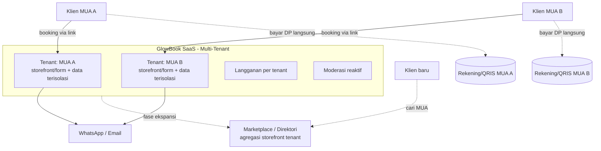
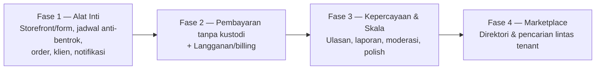

# BRD — SaaS Booking & Manajemen Bisnis untuk MUA
### Working name: **GlowBook** *(placeholder, silakan ganti)*
**Jenis dokumen:** Business Requirements Document (BRD) · **Versi:** 1.0 · **Tanggal:** 30 Juni 2026 · **Status:** Draft untuk disetujui sebelum PRD

> BRD ini mendefinisikan **kebutuhan bisnis tingkat tinggi**: tujuan, pasar, lingkup, proses, aturan, dan kriteria sukses. Detail produk/fitur, UX, dan teknis dibahas terpisah di **PRD** (tahap berikutnya).

---

## 1. Ringkasan Eksekutif

GlowBook adalah **SaaS multi-tenant** untuk Make-Up Artist (MUA) di Indonesia. Setiap MUA (tenant) mendapat **form/storefront booking publik** yang bisa dibagikan di bio Instagram/WhatsApp; kliennya memesan sendiri 24/7, dan MUA mengelola jadwal, layanan, pembayaran (DP/pelunasan), serta data klien dari satu dashboard.

Prinsip bisnis pembeda: **platform tidak pernah menahan dana klien.** Pembayaran mengalir langsung antara klien dan MUA. Platform memonetisasi lewat **langganan bulanan (subscription)**, bukan komisi transaksi. Ke depan, kumpulan storefront tenant dapat diangkat menjadi **marketplace** (direktori MUA yang bisa dicari klien baru) sebagai fase ekspansi.

Strategi masuk: **"come for the tool, stay for the network"** — alat yang langsung berguna untuk klien Instagram MUA yang sudah ada (menyelesaikan masalah cold-start), lalu jaringan/marketplace menyusul.

---

## 2. Latar Belakang & Pernyataan Masalah

MUA di Indonesia mayoritas mengelola bisnis lewat DM Instagram dan WhatsApp secara manual: tanya-jawab harga berulang, jadwal rawan bentrok (akad pagi + wisuda grup di hari yang sama), DP yang sulit ditagih dan diverifikasi, serta tidak ada catatan klien & keuangan yang rapi. Akibatnya: slot hangus, double-book, klien hilang sebelum konfirmasi, dan beban administrasi tinggi.

**Peluang:** menyediakan alat sederhana yang mengubah alur manual menjadi booking mandiri 24/7 dengan jadwal anti-bentrok, pembayaran terstruktur (tanpa platform memegang dana), dan data bisnis yang rapi — dengan pengalaman yang lebih baik daripada spreadsheet atau chat manual.

---

## 3. Tujuan Bisnis & Sasaran

| Kode | Tujuan Bisnis | Sasaran Terukur (indikatif, 12 bulan) |
|------|---------------|----------------------------------------|
| OBJ-1 | Menjadi alat booking & manajemen harian pilihan MUA | ≥300 MUA terdaftar, ≥100 MUA aktif berbayar |
| OBJ-2 | Membangun pendapatan berulang yang sehat | MRR positif & tumbuh; churn bulanan < 5% |
| OBJ-3 | Mengurangi beban admin & no-show MUA | Penurunan double-book ~0; mayoritas booking lewat form, bukan chat manual |
| OBJ-4 | Menyiapkan fondasi ekspansi ke marketplace | ≥1.000 booking publik terproses sbg basis supply & data |
| OBJ-5 | Operasi ringan & patuh | Nol kustodi dana; tanpa kewajiban lisensi sistem pembayaran |

---

## 4. Analisis Pasar & Kompetitor

**Permintaan pasar tervalidasi** — sudah ada beberapa produk sejenis yang aktif, menandakan kebutuhan nyata sekaligus persaingan.

| Pemain | Posisi | Catatan |
|--------|--------|---------|
| **Haipy MUA** (referensi) | SaaS booking MUA | Kelola booking, kirim link form ke klien, cek transport otomatis, kelola wedding/gaun. Positioning: "pengalaman terbaik", bukan fitur terbanyak. |
| **Riasin** | Kompetitor lokal langsung | Link unik di bio IG, booking mandiri 24/7, template WA otomatis (DP/pelunasan/konfirmasi), kalender anti-bentrok, laporan penghasilan, gratis. |
| **Serpis** | Kompetitor lokal langsung | Pricelist→paket, booking 1 link, DP via QRIS sebelum slot dikunci, multi-service (wisuda grup, pengantin+family), custom field lokasi/adat, free + tier Plus (reminder WA, Google Calendar). |
| **HelloBeauty / Mecapan** | Marketplace MUA | Model marketplace discovery (cari & pesan MUA), bukan SaaS-tool. Relevan sebagai arah ekspansi. |
| **GlossGenius / Fresha / Square / StyleSeat** | Internasional | Lengkap + payment processing, tapi tidak fokus pasar & alur Indonesia (QRIS, WA, adat, transport). |

**Implikasi strategis — sumber diferensiasi yang tersedia:**
1. **Tanpa kustodi dana** → lebih ringan, bebas isu regulasi, pesan kepercayaan ("uangmu langsung ke MUA").
2. **Jalur ke marketplace** → kompetitor lokal belum agresif ke discovery.
3. **Fokus regional** (mis. Sulawesi/Indonesia Timur) yang berpotensi under-served.
4. **Pengalaman/UX superior** + alur khas Indonesia (adat, transport, multi-service, WA-first).

---

## 5. Pemangku Kepentingan (Stakeholders)

| Pemangku | Peran | Kepentingan utama |
|----------|------|-------------------|
| **MUA (Tenant)** | Pelanggan pembayar | Booking rapi, jadwal anti-bentrok, dibayar lancar, terlihat profesional, setup cepat |
| **Klien MUA** | Pengguna form publik | Booking mudah & jelas, harga transparan, pembayaran aman langsung ke MUA |
| **Pemilik Platform / Tim** | Penyedia SaaS | Pertumbuhan tenant, MRR, retensi, operasi ringan |
| **Admin Platform** | Operasional | Moderasi reaktif, dukungan, tangani penyalahgunaan |
| **Penyedia Pembayaran** (mis. Midtrans/QRIS) | Pihak ketiga | Pembayaran langsung ke MUA (platform bukan merchant of record) |
| **Penyedia Notifikasi** (WhatsApp/email) | Pihak ketiga | Pengiriman konfirmasi & reminder |

---

## 6. Lingkup Bisnis

### 6.1 Model Multi-Tenant
- **Tenant = satu MUA** (atau studio). Setiap tenant memiliki storefront/form publik sendiri, katalog layanan, jadwal, data klien, dan langganan terpisah.
- **Isolasi data antar-tenant** wajib: data satu MUA tidak dapat diakses MUA lain.
- **Form/storefront publik di-generate otomatis** per tenant (mis. tautan unik untuk bio IG), tanpa perlu MUA membuat website sendiri.

### 6.2 Termasuk dalam Lingkup (MVP)
- Pendaftaran & onboarding tenant + langganan (dengan free trial)
- Pembuatan storefront/form publik per tenant (layanan, harga, durasi, portofolio, pertanyaan booking, transport)
- Booking mandiri oleh klien lewat form publik
- Kalender & penjadwalan anti-bentrok
- **Pembayaran tanpa kustodi**: DP/pelunasan mengalir langsung ke MUA (mekanisme difinalkan di PRD — lihat §13)
- Notifikasi otomatis (WhatsApp/email): konfirmasi, reminder
- Manajemen order, data & riwayat klien, ringkasan pendapatan/laporan
- Ulasan/rating dasar (kredibilitas storefront)
- Admin: moderasi reaktif, dukungan, kelola langganan/plan

### 6.3 Di Luar Lingkup (Fase Lanjutan)
- **Marketplace/discovery terpusat** (direktori & pencarian MUA lintas tenant)
- Chat real-time in-app, aplikasi native/PWA push
- Multi-tier plan kompleks, promo/voucher/referral engine
- Multi-layanan non-MUA (hair, nail, hijab), multi-bahasa/mata uang
- Fitur AI (rekomendasi, virtual try-on)

---

## 7. Kebutuhan Bisnis Tingkat Tinggi

| Kode | Kebutuhan Bisnis |
|------|------------------|
| BR-1 | Sistem harus memungkinkan setiap MUA membuat dan mengelola storefront/form booking publik sendiri tanpa keahlian teknis. |
| BR-2 | Klien harus dapat melakukan booking mandiri 24/7 melalui tautan publik tanpa membuat akun yang berat. |
| BR-3 | Sistem harus mencegah jadwal bentrok (double-book) secara otomatis. |
| BR-4 | Pembayaran (DP/pelunasan) harus dapat difasilitasi **tanpa platform menahan/menguasai dana klien**. |
| BR-5 | Sistem harus mengirim notifikasi otomatis (WhatsApp/email) untuk konfirmasi dan pengingat. |
| BR-6 | MUA harus dapat melihat order, riwayat klien, dan ringkasan pendapatan. |
| BR-7 | Platform harus memonetisasi melalui langganan berulang per tenant, dengan opsi free trial. |
| BR-8 | Data antar-tenant harus terisolasi dan aman; mematuhi UU PDP. |
| BR-9 | Arsitektur harus memungkinkan ekspansi ke marketplace tanpa perombakan besar. |
| BR-10 | Konten storefront tayang otomatis (auto-publish) dengan moderasi reaktif untuk menjaga kualitas. |

---

## 8. Proses Bisnis: Saat Ini vs Masa Depan

**Kondisi Saat Ini (As-Is):**
Klien DM Instagram → tanya harga/tanggal manual → MUA balas satu per satu → janji DP via transfer → bukti sering lupa/terlewat → jadwal dicatat manual (rawan bentrok) → tidak ada riwayat klien/keuangan terstruktur.

**Kondisi Masa Depan (To-Be):**
MUA bagikan link form → klien pilih layanan, tanggal kosong, isi detail → bayar DP **langsung ke MUA** (atau unggah bukti) → slot otomatis terkunci & anti-bentrok → notifikasi WA otomatis → order, klien, dan pendapatan tercatat rapi di dashboard.

---

## 9. Aturan Bisnis Utama (Business Rules)

| Kode | Aturan |
|------|--------|
| RULE-1 | **Platform tidak pernah menjadi penampung/penguasa dana klien.** Dana mengalir langsung MUA↔klien. |
| RULE-2 | Monetisasi = langganan per tenant; **bukan** komisi per transaksi. |
| RULE-3 | Satu slot waktu tidak boleh dipesan ganda; booking terkonfirmasi otomatis memblokir kalender. |
| RULE-4 | Storefront tayang otomatis; kualitas dijaga lewat moderasi reaktif (report/flag) + spot-check. |
| RULE-5 | Akses & data dibatasi per tenant (tenant isolation). |
| RULE-6 | Langganan kedaluwarsa/past-due dapat membatasi fitur tertentu (mis. notifikasi, storefront publik). |

---

## 10. Model Monetisasi

- **Langganan bulanan per tenant** (mulai satu plan; free trial untuk mengatasi keraguan awal).
- Nilai langganan harus terasa **sejak hari pertama** (alat berguna untuk klien IG yang sudah ada), bukan sekadar "didaftarkan" — ini penangkal masalah ayam-telur.
- Potensi pendapatan masa depan: tier Plus (otomasi lanjutan), fitur marketing, dan layer marketplace.
- **Tidak ada** pendapatan dari menahan/men-float dana klien (sesuai RULE-1).

---

## 11. Kriteria Keberhasilan / KPI Bisnis

**North Star:** jumlah **MUA aktif berbayar** (langganan aktif & memakai sistem untuk booking nyata).

Indikator pendukung: trial→paid conversion, churn bulanan, jumlah booking publik terproses, % booking via form vs chat manual, kepuasan/rating tenant, dan (pra-marketplace) jumlah storefront aktif sebagai basis supply.

---

## 12. Asumsi & Batasan

**Asumsi:**
- Mayoritas akuisisi awal lewat MUA membawa klien Instagram-nya sendiri (single-player value).
- Target pasar Indonesia, mobile-first, Bahasa Indonesia, WhatsApp sebagai kanal notifikasi utama.
- MUA bersedia berlangganan jika alatnya jelas menghemat waktu & menaikkan profesionalitas.

**Batasan:**
- Platform tidak boleh menahan dana (RULE-1) → mekanisme pembayaran harus direct-settle/manual.
- Operasi harus ringan (tim kecil) → otomasi & moderasi reaktif, bukan verifikasi manual berat.
- Kategori kompetitif → kecepatan eksekusi & diferensiasi penting.

---

## 13. Pendekatan Solusi Tingkat Tinggi

Catatan: **dana tidak melewati Platform** (garis putus-putus = langsung ke akun MUA). Platform memegang form, jadwal, data, notifikasi, dan langganan — bukan uang.

### Kandidat mekanisme pembayaran tanpa kustodi (difinalkan di PRD)
| Opsi | Cara kerja | Plus / Minus |
|------|------------|--------------|
| **A. QRIS/akun MUA sendiri** | MUA hubungkan QRIS/akun pembayarannya; form menampilkan, dana settle langsung ke MUA | Profesional & otomatis · perlu tiap MUA punya akun |
| **B. Manual transfer + bukti** | Klien transfer ke rekening/QRIS MUA, unggah bukti, MUA konfirmasi | Paling sederhana, nol integrasi · ada langkah manual |
| **C. Payment link direct-settle** | Gateway buat link yang settle ke MUA (MUA sebagai merchant of record) | Mulus · perlu dukungan gateway untuk routing ke MUA |
> Rekomendasi MVP: mulai **B (manual + bukti)** dan/atau **A (QRIS MUA)** — nol kustodi, cepat, bebas beban regulasi. C dipertimbangkan saat skala.

---

## 14. Risiko Bisnis & Mitigasi

| Risiko | Dampak | Mitigasi |
|--------|--------|----------|
| Pasar sudah ramai (Riasin, Serpis, Haipy) | Tinggi | Diferensiasi jelas (no-kustodi, marketplace, regional, UX); eksekusi cepat |
| Ayam-telur langganan | Tinggi | Alat berguna hari-1 + free trial; tegakkan billing setelah value terbukti |
| Kebocoran (klien & MUA transaksi di luar) | Sedang | Karena monetisasi = langganan (bukan komisi), kebocoran kurang merugikan |
| Penyalahgunaan (auto-publish) | Sedang | Moderasi reaktif + report/flag + sinyal rating |
| Pembayaran manual rawan sengketa | Sedang | Alur bukti + konfirmasi jelas; opsi QRIS langsung untuk otomatisasi |
| Ketergantungan WhatsApp (kebijakan/limit) | Sedang | Sediakan fallback email; pakai penyedia WA yang patuh |

---

## 15. Roadmap Fase Bisnis

---

## 16. Keputusan Terbuka untuk Tahap PRD

1. **Mekanisme pembayaran tanpa kustodi** — pilih A / B / C (§13).
2. **Cakupan plan langganan** — satu plan vs free + Plus sejak awal.
3. **Kebijakan free trial** — durasi & batasan.
4. **Aturan transport/lokasi & multi-service** — sejauh mana didukung di MVP.
5. **Kebijakan saat langganan past-due** — apa yang dibatasi (RULE-6).

> Setelah BRD ini disetujui, lanjut ke **PRD** (fitur detail, user stories, UX, model data, arsitektur) yang menerjemahkan kebutuhan bisnis di atas ke spesifikasi produk.
