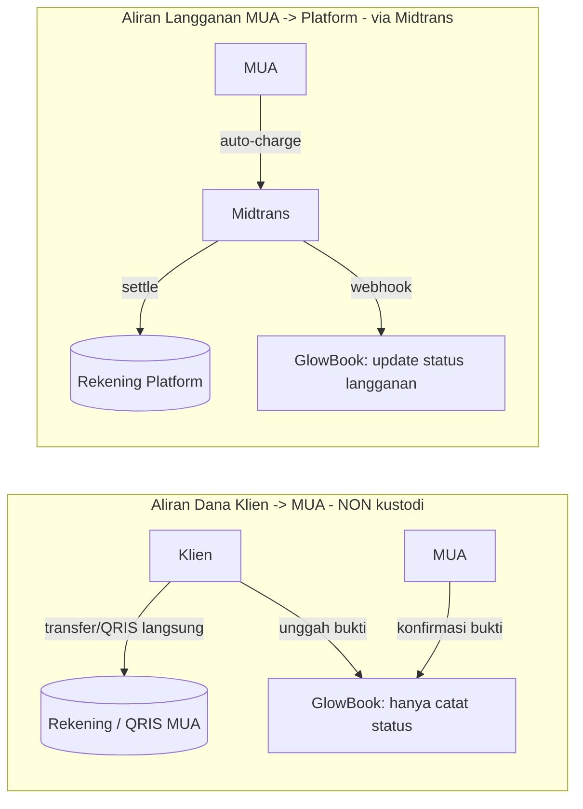
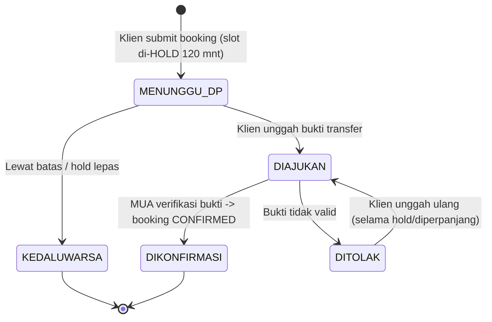
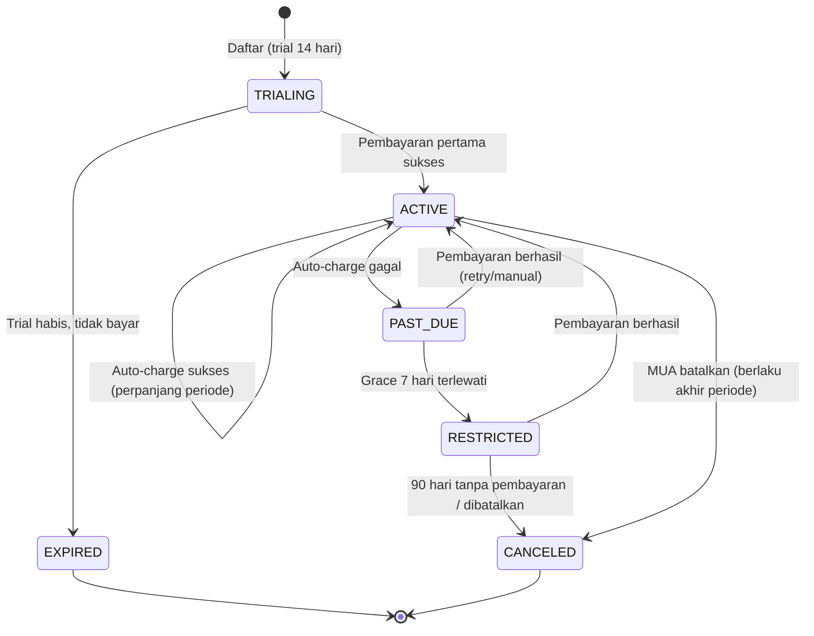
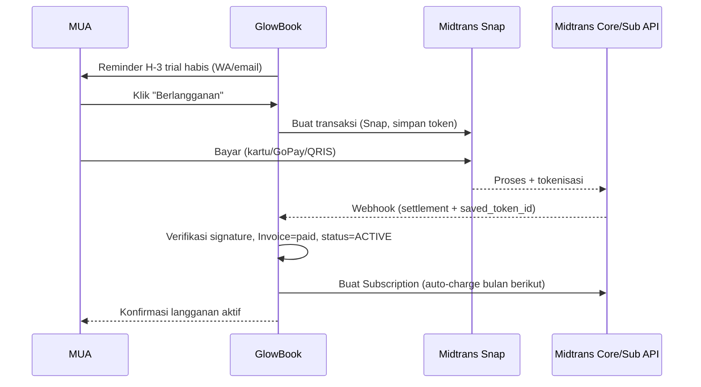

# PRD — SaaS Booking & Manajemen Bisnis untuk MUA
### Working name: **GlowBook** *(mengikuti BRD; silakan ganti)*
**Jenis dokumen:** Product Requirements Document (PRD) · **Versi:** 1.0 · **Tanggal:** 30 Juni 2026 · **Status:** Draft
**Turunan dari:** [BRD-MUA-SaaS.md](BRD-MUA-SaaS.md) v1.0

> PRD ini menerjemahkan kebutuhan bisnis pada BRD menjadi spesifikasi produk: persona, fitur, user story, model data, alur, state machine, dan kriteria penerimaan. **Fokus mendalam** dokumen ini ada pada **mekanisme pembayaran**:
> - **Pembayaran klien → MUA:** **manual transfer + bukti** (tanpa kustodi platform).
> - **Langganan MUA → Platform:** **otomatis via Midtrans** (auto-charge, settle ke rekening platform).

---

## 1. Pendahuluan

### 1.1 Tujuan Dokumen
Mendefinisikan apa yang harus dibangun pada **MVP** GlowBook dan bagaimana perilakunya, cukup detail untuk desain UX, implementasi engineering, dan QA.

### 1.2 Keputusan yang Sudah Difinalkan (resolusi BRD §16)
| # | Keputusan Terbuka (BRD) | Keputusan PRD |
|---|--------------------------|----------------|
| 1 | Mekanisme pembayaran tanpa kustodi | **Klien→MUA = manual transfer + bukti (Opsi B).** Langganan MUA→Platform = **Midtrans otomatis**. |
| 2 | Cakupan plan langganan | **Satu plan berbayar** untuk MVP; arsitektur disiapkan untuk multi-plan (Plus) kelak. |
| 3 | Kebijakan free trial | **14 hari, akses penuh, tanpa kartu di muka.** Prompt berlangganan mulai H-3 sebelum trial habis. |
| 4 | Transport/lokasi & multi-service | MVP **mendukung**: multi-layanan per booking (line items), biaya transport (flat / per-zona), dan custom field (lokasi, adat, dll.). |
| 5 | Kebijakan past-due (RULE-6) | **Grace 7 hari** → mode terbatas (storefront unpublish, notifikasi nonaktif, dashboard read-only). Data ditahan 90 hari. |

### 1.3 Prinsip Produk (warisan BRD)
1. **Nol kustodi dana klien** — dana DP/pelunasan klien tidak pernah melewati platform.
2. **Berguna sejak hari pertama** (single-player value) sebelum jaringan.
3. **Mobile-first, Bahasa Indonesia, WhatsApp-first**.
4. **Operasi ringan** — otomasi & moderasi reaktif, bukan verifikasi manual berat.
5. **Multi-tenant dengan isolasi data ketat**.

---

## 2. Persona & Peran

| Peran | Deskripsi | Akses |
|-------|-----------|-------|
| **MUA (Tenant/Owner)** | Pelanggan berbayar; mengelola storefront, layanan, jadwal, order, klien, langganan. | Dashboard penuh untuk tenant-nya. |
| **Staf MUA** *(opsional, fase lanjutan)* | Asisten yang dibantu mengelola jadwal/order. | Terbatas, di luar MVP. |
| **Klien** | Pemesan via form publik; tidak perlu akun berat. | Akses form publik + halaman status booking via tautan/OTP. |
| **Admin Platform** | Tim internal; moderasi reaktif, dukungan, kelola plan. | Konsol admin lintas-tenant (read-mostly + tindakan moderasi). |

---

## 3. Ruang Lingkup MVP

### 3.1 Termasuk
- Pendaftaran & onboarding tenant + **free trial 14 hari**.
- **Langganan otomatis via Midtrans** (auto-charge) + penanganan past-due.
- Storefront/form publik per tenant (layanan, harga, durasi, portofolio, transport, custom field).
- Booking mandiri 24/7 oleh klien.
- Kalender & penjadwalan **anti-bentrok** (termasuk hold sementara).
- **Pembayaran klien→MUA manual** (DP/pelunasan) + unggah bukti + konfirmasi MUA.
- Notifikasi otomatis WhatsApp & email (konfirmasi, reminder, status pembayaran).
- Manajemen order, data & riwayat klien, ringkasan pendapatan/laporan.
- Ulasan/rating dasar.
- Konsol admin: moderasi reaktif, kelola plan/langganan, dukungan.

### 3.2 Tidak Termasuk (Fase Lanjutan)
Marketplace/discovery lintas tenant, chat in-app real-time, PWA/push native, multi-tier plan kompleks + voucher/referral engine, kategori non-MUA, multi-bahasa/mata uang, fitur AI, **pembayaran klien→MUA otomatis via gateway** (dipertimbangkan saat skala).

---

## 4. Arsitektur Tingkat Tinggi & Multi-Tenancy

- **Model tenancy:** shared database, **tenant_id pada setiap row** + row-level enforcement di seluruh query/layanan. Setiap permintaan terikat ke `tenant_id` dari sesi/host.
- **Routing storefront:** subdomain atau path unik per tenant (mis. `glowbook.id/@namamua` atau `namamua.glowbook.id`).
- **Isolasi data:** tidak ada endpoint yang mengembalikan data lintas tenant kecuali konsol admin (di-audit).
- **Pemisahan dana:**
  - **Dana klien (DP/pelunasan):** TIDAK pernah masuk sistem/rekening platform. Platform hanya **menampilkan instruksi pembayaran MUA** dan **mencatat status** berbasis bukti + konfirmasi MUA.
  - **Dana langganan (MUA→Platform):** melalui **akun Midtrans milik Platform**, settle ke rekening Platform. Inilah satu-satunya aliran uang yang disentuh platform.

---

## 5. Model Data (Inti)

> Notasi ringkas; tipe & index final di desain teknis. Semua entitas tenant-scoped kecuali ditandai **[global]**.

- **Tenant** `id, slug, nama_bisnis, kota, status(active/trial/past_due/restricted/canceled), created_at`
- **User** `id, tenant_id, role(owner/staff/admin), email, phone, auth_*`
- **PaymentProfile** (instruksi bayar MUA, *no-custody*) `id, tenant_id, jenis(bank/qris/ewallet), bank_nama, no_rekening, atas_nama, qris_image_url, instruksi_tambahan, is_active`
- **Service** `id, tenant_id, nama, deskripsi, harga, durasi_menit, dp_tipe(persen/nominal), dp_nilai, butuh_transport(bool), aktif`
- **TransportRule** `id, tenant_id, mode(flat/zona), flat_nominal | zona[{nama, nominal}]`
- **CustomField** `id, tenant_id, label, tipe(text/select/date/file), wajib(bool), opsi[]`
- **Portfolio** `id, tenant_id, image_url, caption, urutan`
- **Availability** `id, tenant_id, hari, jam_mulai, jam_selesai, slot_durasi, kapasitas`
- **BlockedDate** `id, tenant_id, tanggal/range, alasan`
- **Booking** `id, tenant_id, kode, client_id, tanggal, jam_mulai, jam_selesai, status, subtotal, transport_fee, total, dp_amount, sisa_amount, lokasi, custom_values{}, created_at`
- **BookingItem** `id, booking_id, service_id, qty, harga_snapshot`
- **Client** `id, tenant_id, nama, phone, email, catatan, total_booking, created_at`
- **Payment** (catatan pembayaran klien, *manual*) `id, tenant_id, booking_id, jenis(dp/pelunasan), metode, amount, proof_url, status(menunggu/diajukan/dikonfirmasi/ditolak), submitted_at, confirmed_at, confirmed_by`
- **Subscription** `id, tenant_id, plan_id, status(trialing/active/past_due/canceled/expired), trial_end, current_period_start, current_period_end, midtrans_subscription_id, saved_token_id, payment_method, retry_count`
- **Invoice** `id, tenant_id, subscription_id, periode, amount, status(paid/pending/failed), midtrans_order_id, paid_at, pdf_url`
- **Plan** **[global]** `id, nama, harga, interval(monthly), fitur{}, aktif`
- **Review** `id, tenant_id, booking_id, rating(1-5), komentar, status(published/flagged/hidden), created_at`
- **Notification** `id, tenant_id, kanal(wa/email), template, target, payload, status, sent_at`
- **AuditLog** **[global]** `id, actor, tenant_id, aksi, entity, before, after, at`

---

## 6. Spesifikasi Fitur & User Stories

> Traceability: setiap modul memetakan ke BR-x pada BRD.

### 6.1 Onboarding Tenant & Langganan — *(BR-7)*
- **US-ON-1:** Sebagai MUA, saya daftar dengan email/nomor WA + verifikasi OTP, lalu mengisi profil bisnis (nama, kota, slug storefront).
- **US-ON-2:** Sebagai MUA, saya langsung mendapat **free trial 14 hari akses penuh tanpa kartu**.
- **US-ON-3:** Sebagai MUA, saya dipandu setup minimum siap-tayang: ≥1 layanan, jam tersedia, dan **PaymentProfile** (rekening/QRIS untuk DP).
- **Kriteria penerimaan:** storefront otomatis ter-generate & dapat dibagikan begitu setup minimum selesai (BR-1, BR-10).

### 6.2 Storefront / Form Publik — *(BR-1, BR-2, BR-10)*
- Menampilkan: nama/branding, portofolio, daftar layanan (harga, durasi), aturan transport, FAQ, rating.
- **Auto-publish** saat setup minimum lengkap; moderasi reaktif (report/flag).
- Mobile-first, dapat dibuka tanpa login.
- **US-SF-1:** Sebagai klien, saya membuka link di bio IG dan melihat layanan + harga transparan tanpa harus DM.

### 6.3 Katalog Layanan, Transport & Custom Field
- CRUD layanan dengan **DP per layanan** (persen atau nominal).
- **Multi-layanan per booking** (line item) untuk kasus wisuda grup / pengantin + family.
- Transport: **flat** atau **per-zona**; ditambahkan ke total.
- Custom field (lokasi, adat, jumlah orang) — text/select/date/file, wajib/opsional.

### 6.4 Booking Mandiri oleh Klien — *(BR-2, BR-3)*
Alur: pilih layanan → pilih tanggal & slot **kosong** → isi data + custom field → ringkasan biaya (subtotal + transport, DP yang harus dibayar) → submit → instruksi pembayaran DP.
- Klien tidak perlu akun; identifikasi via nomor WA + kode booking + OTP untuk halaman status.
- **US-BK-1:** Sebagai klien, saat memilih slot, saya hanya melihat waktu yang benar-benar tersedia (anti-bentrok).

### 6.5 Kalender & Anti-Bentrok — *(BR-3, RULE-3)*
- Slot dihitung dari `Availability` − `BlockedDate` − booking `confirmed` − **hold sementara**.
- **Hold sementara:** saat klien submit booking, slot di-*hold* (default **120 menit**) menunggu bukti DP; jika lewat tanpa bukti/konfirmasi → hold dilepas otomatis.
- Booking **confirmed** mengunci kalender permanen.
- **US-CAL-1:** Sebagai MUA, dua klien tidak bisa mengunci slot yang sama; yang kedua melihat slot tak tersedia begitu yang pertama di-hold/confirmed.

### 6.6 Pembayaran Klien → MUA (MANUAL, NON-KUSTODI) — *(BR-4, RULE-1)* → **lihat Bab 7**

### 6.7 Langganan MUA → Platform (MIDTRANS OTOMATIS) — *(BR-7, RULE-2, RULE-6)* → **lihat Bab 8**

### 6.8 Notifikasi Otomatis — *(BR-5)*
- Kanal: **WhatsApp (utama)** + **email (fallback)**.
- Pemicu: booking masuk, instruksi DP, bukti diterima, booking dikonfirmasi/ditolak, reminder H-1 acara, reminder pelunasan, status langganan (gagal bayar, masuk grace, restricted).
- Template berbahasa Indonesia, variabel ter-isi (nama, tanggal, jumlah, link).

### 6.9 Manajemen Order & Klien — *(BR-6)*
- Daftar order dengan filter status/tanggal; detail booking; ubah status (konfirmasi, selesai, batal, reschedule).
- Profil klien otomatis terbentuk dari booking; riwayat & catatan.

### 6.10 Laporan & Pendapatan — *(BR-6)*
- Ringkasan: pendapatan tercatat (berbasis pembayaran terkonfirmasi), jumlah booking, layanan terlaris, DP vs pelunasan.
- Catatan: angka berbasis **konfirmasi MUA**, bukan rekonsiliasi bank (karena no-custody).

### 6.11 Ulasan/Rating Dasar
- Diminta otomatis setelah booking `selesai`; tayang di storefront; dapat di-flag.

### 6.12 Konsol Admin & Moderasi — *(RULE-4, BR-10)*
- Lihat tenant, status langganan, dan invoice.
- Tangani report/flag storefront & review; suspend tenant yang melanggar.
- Kelola Plan (harga, fitur) **[global]**.

---

## 7. BAB MENDALAM A — Pembayaran Klien → MUA (Manual, Non-Kustodi)

### 7.1 Prinsip
Platform **tidak menerima, menahan, atau menyalurkan** dana klien. Dana ditransfer **langsung** ke rekening/QRIS MUA. GlowBook hanya:
1. **Menampilkan instruksi pembayaran** MUA (dari `PaymentProfile`).
2. **Menerima unggahan bukti** dari klien.
3. **Mencatat status** berdasarkan **konfirmasi manual MUA**.

### 7.2 Komponen Pembayaran
- **DP (Down Payment):** dihitung dari setting layanan (persen/nominal), dibayar untuk mengunci slot.
- **Pelunasan (Sisa):** `total − dp_amount`, jatuh tempo sebelum/pada hari acara (kebijakan MUA), boleh ditandai "cash on the day".

### 7.3 Alur DP (mengunci slot)

- Saat **DIKONFIRMASI**, booking → `confirmed`, slot terkunci permanen, notifikasi WA terkirim ke klien.
- Saat **KEDALUWARSA**, slot dilepas agar klien lain bisa memesan.

### 7.4 Alur Pelunasan
- Reminder otomatis (H-3 / H-1) via WA/email berisi instruksi & nominal sisa.
- Klien unggah bukti → MUA konfirmasi → booking ditandai **Lunas**.
- Opsi MUA menandai **"dibayar tunai di lokasi"** tanpa bukti.

### 7.5 Aturan & Edge Case
| Kasus | Penanganan |
|------|------------|
| Nominal bukti tidak sesuai | MUA tolak dengan alasan; klien diminta unggah ulang / transfer selisih. |
| Bukti palsu/duplikat | Tanggung jawab verifikasi pada MUA; platform sediakan jejak (timestamp, gambar) untuk sengketa. |
| Klien tidak bayar dalam hold | Hold lepas otomatis; booking `expired`; slot kembali tersedia. |
| Pembatalan & refund DP | Diatur **di luar platform** (kebijakan refund MUA); platform mencatat status `dibatalkan` + catatan refund. |
| Reschedule | MUA pindahkan ke slot kosong baru; cek anti-bentrok; DP tetap mengikat. |
| Sengketa | Platform **tidak menengahi dana** (no-custody); hanya menyediakan log bukti & komunikasi. |

### 7.6 Kebijakan Anti-Penyalahgunaan
- Platform menampilkan disclaimer: "Pembayaran langsung ke MUA; GlowBook tidak menyimpan dana Anda."
- Rate-limit unggahan bukti & deteksi spam booking.

### 7.7 Kriteria Penerimaan (Bab A)
1. Tidak ada endpoint/flow di mana saldo dana klien tersimpan di platform.
2. Slot hanya terkunci permanen setelah MUA mengonfirmasi DP.
3. Setiap perubahan status pembayaran ter-audit (siapa, kapan).

---

## 8. BAB MENDALAM B — Langganan MUA → Platform (Midtrans, Otomatis)

### 8.1 Tujuan & Cakupan
Memungut **langganan bulanan per tenant secara otomatis** dengan Midtrans, settle langsung ke **rekening Platform**. Ini pendapatan platform (RULE-2) dan **tidak melanggar RULE-1** (RULE-1 hanya melarang menahan **dana klien**).

### 8.2 Plan (MVP)
| Field | Nilai MVP |
|-------|-----------|
| Nama | **GlowBook Pro** *(placeholder)* |
| Harga | **Rp99.000 / bulan** *(placeholder — finalkan)* |
| Interval | Bulanan |
| Trial | 14 hari, tanpa kartu di muka |
| Fitur | Semua fitur MVP aktif |

> Arsitektur `Plan` **[global]** disiapkan untuk multi-plan (Plus) tanpa refactor besar.

### 8.3 Metode Pembayaran & Strategi Auto-Charge
Midtrans tidak semua metode mendukung auto-charge. Strategi dua jalur:

| Jalur | Metode | Mekanisme | Pengalaman |
|------|--------|-----------|------------|
| **Auto-charge (utama)** | Kartu kredit/debit, **GoPay** (tokenization) | **Midtrans Subscription API** dengan `saved_token_id` → Midtrans menagih otomatis tiap periode | Sepenuhnya otomatis |
| **Invoice + Snap (fallback)** | QRIS, VA bank, e-wallet non-tokenizable | Sistem buat **Invoice** + kirim **Snap payment link** sebelum jatuh tempo; MUA bayar manual tiap bulan | Semi-otomatis (notifikasi + 1 klik bayar) |

- Saat onboarding/aktivasi langganan, MUA memilih metode. Jika memilih kartu/GoPay → token disimpan → masuk jalur auto-charge. Jika lainnya → jalur invoice.
- Pembayaran pertama (akhir trial) memakai **Snap** untuk sekaligus melakukan tokenisasi (mengaktifkan auto-charge berikutnya).

### 8.4 Integrasi Teknis Midtrans
- **Akun:** Midtrans **milik Platform** (production server key disimpan di secret manager, **tidak pernah** di klien).
- **Snap (front-end):** untuk pembayaran pertama & fallback invoice; client key publik untuk render Snap.
- **Subscription API:** `POST /v1/subscriptions` dengan `name, amount, currency=IDR, payment_type, token (saved_token_id), schedule{interval:1, interval_unit:month, start_time}, retry_schedule`.
- **Core API (opsional):** charge manual menggunakan `saved_token_id` bila tidak memakai Subscription API native.
- **HTTP Notification (Webhook):** endpoint `POST /webhooks/midtrans` untuk menerima status transaksi & subscription.

### 8.5 Verifikasi & Keamanan Webhook
- **Verifikasi signature wajib** sebelum memproses:
  `signature_key == SHA512(order_id + status_code + gross_amount + ServerKey)`.
- **Idempotensi:** proses berdasarkan `order_id`/`transaction_id`; abaikan duplikat.
- **Sumber kebenaran:** status final diambil/dikonfirmasi via **Get Status API** Midtrans, bukan hanya payload webhook.
- **Anti-replay & TLS:** hanya HTTPS; tolak payload tanpa signature valid.
- **PCI:** GlowBook **tidak menyimpan PAN**; hanya `saved_token_id` dari Midtrans (tokenization di sisi Midtrans/Snap).

### 8.6 Pemetaan Status Transaksi Midtrans → Internal
| Midtrans `transaction_status` | `fraud_status` | Tindakan Internal |
|---|---|---|
| `capture` | `accept` | Invoice **paid**, perpanjang periode |
| `settlement` | — | Invoice **paid**, perpanjang periode |
| `pending` | — | Invoice **pending** (tunggu) |
| `deny` / `cancel` / `expire` | — | Invoice **failed** → masuk alur retry/dunning |
| `refund` / `partial_refund` | — | Catat refund (lihat §8.9) |
| `capture` | `challenge` | Tahan, tinjau manual |

### 8.7 State Machine Langganan

### 8.8 Dunning (Penagihan Gagal) & Past-Due — *(RULE-6)*
- **Retry schedule** (Midtrans + internal): H+0, H+1, H+3, H+7 setelah gagal.
- Notifikasi WA/email tiap percobaan: "pembayaran gagal, mohon perbarui metode".
- **Grace period 7 hari** di status `PAST_DUE`: fitur tetap aktif.
- Setelah grace habis → `RESTRICTED`:
  - **Storefront publik di-unpublish** (tautan menampilkan "sementara tidak aktif").
  - **Notifikasi otomatis dinonaktifkan**.
  - **Dashboard read-only** (lihat data, tidak bisa terima booking baru).
  - Data ditahan **90 hari** sebelum diarsipkan/dihapus (sesuai PDP).
- Begitu pembayaran berhasil → kembali `ACTIVE`, storefront tayang lagi otomatis.

### 8.9 Refund, Proration & Pembatalan
- **MVP: tanpa proration.** Pembatalan oleh MUA berlaku **di akhir periode berjalan** (akses tetap sampai `current_period_end`).
- **Tanpa refund** untuk periode berjalan kecuali kasus khusus yang disetujui admin (refund manual via Midtrans, dicatat di `Invoice`).
- Auto-charge dihentikan saat status `canceled`.

### 8.10 Invoice & Bukti
- Setiap siklus menghasilkan `Invoice` (nomor, periode, jumlah, status, `midtrans_order_id`).
- Invoice/kuitansi PDF dapat diunduh MUA; riwayat tampil di menu Billing.

### 8.11 Alur Lengkap Aktivasi (akhir trial)

### 8.12 Kriteria Penerimaan (Bab B)
1. Tidak ada server key Midtrans yang terekspos ke klien/browser.
2. Setiap webhook diverifikasi signature & idempoten; status final dikonfirmasi via Get Status API.
3. Auto-charge sukses memperpanjang periode tanpa intervensi manual.
4. Kegagalan bayar memicu dunning, lalu pembatasan fitur sesuai §8.8 setelah grace.
5. Trial habis tanpa bayar → fitur dibatasi, data ditahan 90 hari.

---

## 9. Notifikasi — Spesifikasi

| Pemicu | Kanal | Penerima | Isi |
|--------|-------|----------|-----|
| Booking baru masuk | WA/email | MUA | Detail booking + link konfirmasi |
| Instruksi DP | WA/email | Klien | Nominal DP, rekening/QRIS MUA, batas waktu |
| Bukti diterima | WA | MUA | Minta verifikasi |
| Booking dikonfirmasi/ditolak | WA/email | Klien | Status + langkah berikutnya |
| Reminder acara H-1 | WA | Klien & MUA | Tanggal, jam, lokasi |
| Reminder pelunasan | WA/email | Klien | Sisa & instruksi |
| Langganan: gagal bayar / grace / restricted | WA/email | MUA | Status + CTA bayar |

- **Fallback:** jika WA gagal/limit → kirim email.
- **Mitigasi ketergantungan WA** (BRD risiko): gunakan penyedia WA Business API yang patuh; rancang template agar lolos kebijakan.

---

## 10. Kebutuhan Non-Fungsional

| Kategori | Kebutuhan |
|----------|-----------|
| **Keamanan** | Enkripsi at-rest untuk PII & kredensial; secret di secret manager; RBAC; audit log tindakan sensitif. |
| **Isolasi tenant** | Setiap query difilter `tenant_id`; uji kebocoran lintas-tenant. |
| **Kepatuhan PDP** | Persetujuan data, hak hapus/akses, retensi (data restricted 90 hari), data minimization. |
| **Privasi pembayaran** | Tidak menyimpan PAN; hanya token Midtrans. |
| **Kinerja** | Halaman storefront & pemilihan slot < 2 dtk (mobile, 4G). |
| **Ketersediaan** | Target uptime 99.5%; webhook endpoint idempoten & tahan retry. |
| **Observability** | Log transaksi langganan, status webhook, kegagalan notifikasi. |
| **Skalabilitas** | Arsitektur siap marketplace (BR-9) tanpa perombakan besar. |

---

## 11. Analytics & KPI (selaras BRD §11)
- **North Star:** MUA aktif berbayar.
- Lacak: trial→paid conversion, churn bulanan, jumlah booking publik terproses, % booking via form vs chat, rating tenant, storefront aktif.
- Event kunci: `signup`, `storefront_published`, `booking_created`, `dp_confirmed`, `subscription_activated`, `payment_failed`, `restricted`.

---

## 12. Rencana Rilis (selaras Roadmap BRD §15)
| Rilis | Isi |
|-------|-----|
| **R1 — Alat Inti** | Onboarding, storefront/form, layanan, kalender anti-bentrok, booking, order & klien, notifikasi dasar. |
| **R2 — Pembayaran & Billing** | Pembayaran klien→MUA manual + bukti (Bab 7); **langganan Midtrans otomatis + dunning** (Bab 8). |
| **R3 — Kepercayaan & Skala** | Ulasan/rating, laporan, moderasi, polish, observability. |
| **R4 — Marketplace** | Direktori & pencarian lintas tenant (di luar MVP). |

---

## 13. Keputusan Terbuka untuk Iterasi Berikut
1. **Finalisasi harga plan** & apakah ada tier Plus sejak R3.
2. **Penyedia WhatsApp** (Business API) & batas template.
3. **Metode auto-charge** yang didukung di awal (kartu+GoPay vs invoice-only) berdasarkan profil MUA target.
4. Apakah **transport per-km/maps** diperlukan di MVP atau cukup flat/zona.
5. Kebijakan **arsip/hapus data** detail setelah 90 hari restricted (PDP).

---

## 14. Lampiran — Ringkasan Traceability
| BRD | Dipenuhi oleh PRD |
|-----|-------------------|
| BR-1 Storefront mandiri | §6.1, §6.2 |
| BR-2 Booking mandiri 24/7 | §6.4 |
| BR-3 Anti-bentrok | §6.5 |
| BR-4 Pembayaran tanpa kustodi | **Bab 7** |
| BR-5 Notifikasi otomatis | §6.8, §9 |
| BR-6 Order/klien/pendapatan | §6.9, §6.10 |
| BR-7 Langganan berulang + trial | §6.1, **Bab 8** |
| BR-8 Isolasi data & PDP | §4, §10 |
| BR-9 Siap marketplace | §4, §10 |
| BR-10 Auto-publish + moderasi | §6.2, §6.12 |
| RULE-1 Nol kustodi dana klien | **Bab 7**, §4 |
| RULE-2 Monetisasi = langganan | **Bab 8** |
| RULE-6 Past-due membatasi fitur | §8.8 |
