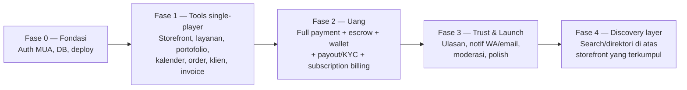
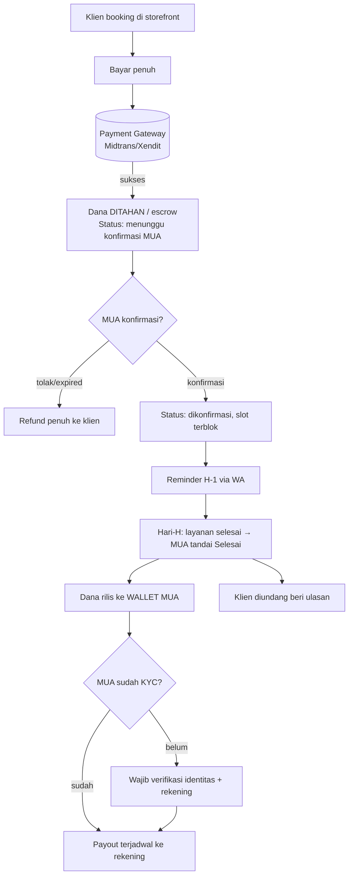
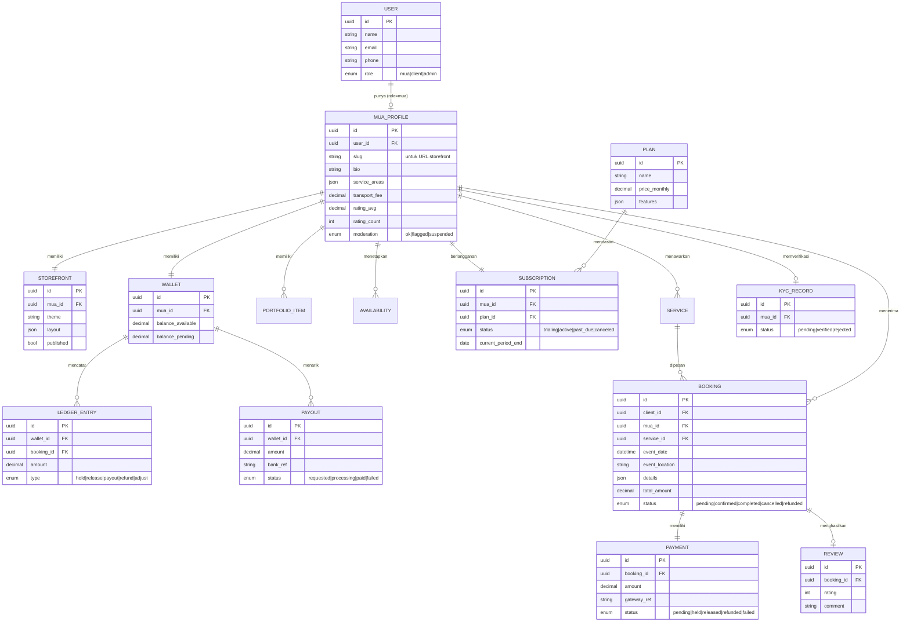
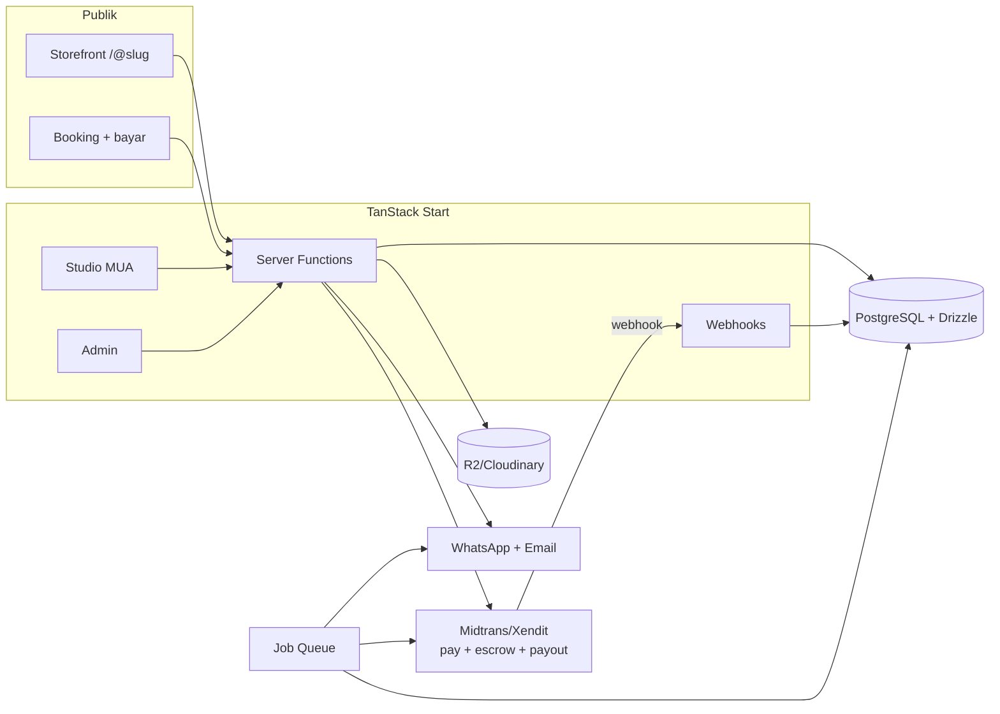

# PRD — Vertical SaaS untuk MUA
### Working name: **GlowBook** *(placeholder, silakan ganti)*
**Versi:** 0.2 (revisi arah: SaaS/storefront-first) · **Tanggal:** 30 Juni 2026 · **Stack:** TanStack Start (React, full-stack)

> **Perubahan dari v0.1:** Arah bergeser dari *marketplace dua sisi* menjadi **vertical SaaS untuk MUA** (pola StyleSeat / Booksy / Serein MUA). Keputusan terkunci: **monetisasi = subscription MUA**, **pembayaran = full payment via platform (escrow)**, **listing = auto-publish + moderasi**. Discovery/marketplace ditunda ke pasca-MVP.

---

## 1. Ringkasan Eksekutif

GlowBook adalah **SaaS untuk Make-Up Artist**: satu tempat untuk mengelola booking, jadwal, pembayaran, invoice, dan data klien — plus **storefront** (halaman publik berisi layanan, harga, portofolio, dan tombol booking) yang bisa dibagikan di bio Instagram/WhatsApp.

Pelanggan utama = **MUA** (mereka yang membayar). Klien MUA adalah pengguna sekunder yang booking lewat storefront. Marketplace discovery (klien menemukan MUA baru) adalah **lapisan yang ditambahkan belakangan** di atas kumpulan storefront.

**Loop inti produk (MVP):**

```
MUA daftar → setup storefront (layanan, harga, portofolio, jadwal) → bagikan link (bio IG)
→ klien lama buka link → booking + bayar penuh (via platform, dana di-escrow)
→ MUA kelola di "Studio" (konfirmasi / jadwal ulang / selesai)
→ dana rilis ke wallet saat selesai → payout ke rekening (gerbang KYC) → klien beri ulasan
   ⮑ MUA membayar subscription bulanan untuk semua tool ini
```

**Mengapa model ini menang untuk cold-start:** karena nilainya berguna sejak hari pertama untuk klien IG yang sudah dimiliki MUA, kamu tidak perlu menunggu likuiditas marketplace. Kamu kumpulkan supply + transaksi dulu, lalu nyalakan discovery. *"Come for the tool, stay for the network."*

---

## 2. Strategi Build (kritikal)



Prinsip: **tool dulu, uang, lalu network.** Fase 1 sudah harus berguna (MUA pakai untuk klien sendiri) bahkan sebelum pembayaran online aktif. Subscription baru ditegakkan setelah value + pembayaran ada (gunakan free trial / early access gratis di awal).

---

## 3. Persona

**Primer — MUA Freelance (Mela, 25).** Punya 5–15 klien/bulan dari IG. Capek admin manual (DM, tanya tanggal, kejar DP, catat di notes). Mau order rapi, jadwal anti-bentrok, terlihat profesional, dan dibayar tanpa ribet. Onboarding harus cepat; tool harus langsung berguna untuk klien yang sudah ada.

**Sekunder — Klien MUA (Sari/Dina).** Diberi link storefront oleh MUA pilihannya. Mau cek layanan & harga, lihat tanggal kosong, booking, dan bayar dengan aman dalam beberapa tap. Tidak harus mencari di direktori (itu fase berikutnya).

**Internal — Admin.** Moderasi reaktif (tangani report/flag), spot-check, kelola plan & payout, tangani sengketa.

*(Persona "klien pencari MUA baru" baru relevan saat Fase 4 / discovery.)*

---

## 4. Keputusan Terkunci

| # | Keputusan | Pilihan | Konsekuensi utama |
|---|-----------|---------|-------------------|
| 1 | **Monetisasi** | **Subscription bulanan MUA** | Butuh billing berulang; nilai harus ada sejak hari-1 (tools), bukan sekadar listing. Free trial untuk atasi ayam-telur. |
| 2 | **Pembayaran** | **Full payment via platform, escrow** | Butuh wallet/ledger + payout + refund. Dana ditahan sampai layanan selesai. |
| 3 | **Listing** | **Auto-publish + moderasi** | Supply cepat. Anti-fraud dipindah ke gerbang payout (KYC) + escrow + report. |
| 4 | Pasar | Indonesia, mobile-first, Bahasa Indonesia | Gateway lokal + WhatsApp |
| 5 | Platform | Web (mobile-first), native menyusul | — |

**Dua design move yang membuat keputusan 2 & 3 aman:**
1. **Escrow:** dana ditahan hingga layanan dikonfirmasi selesai, baru masuk wallet MUA.
2. **KYC di pencairan, bukan pendaftaran:** siapa pun boleh publish & terima booking, tapi untuk menarik uang wajib verifikasi identitas + rekening. Penipu tak bisa kabur membawa uang.

---

## 5. Lingkup MVP

### ✅ Masuk MVP
- Auth + onboarding MUA; pilih plan + free trial
- **Storefront builder:** profil, layanan & harga, add-on, portofolio, area & biaya transport, kebijakan
- **Halaman storefront publik** (link unik per MUA, mis. `glowbook.app/@mela`) dengan tombol booking
- **Kalender ketersediaan** (anti-bentrok otomatis saat ada booking)
- **Booking dari storefront** oleh klien (pilih layanan → tanggal/jam → lokasi → detail look → bayar penuh)
- **Pembayaran penuh + escrow** (gateway lokal: QRIS/VA/e-wallet)
- **Studio (dashboard MUA):** kelola order (konfirmasi/tolak/jadwal ulang/selesai), data klien, invoice (PDF), wallet & ringkasan pendapatan
- **Wallet + payout** ke rekening (gerbang KYC pada payout pertama)
- **Subscription billing** (berulang) + status langganan
- **Ulasan & rating** (setelah "selesai") → kredibilitas storefront
- **Notifikasi WhatsApp + email** (konfirmasi, reminder H-1, status payout)
- **Admin:** moderasi reaktif (report/flag), kelola user/plan/payout, sengketa dasar

### ❌ Ditunda (pasca-MVP)
- **Discovery/search marketplace terpusat** (Fase 4) — direktori, filter global, ranking
- Chat real-time in-app (MVP: arahkan ke WA / template pesan)
- Native app, PWA push
- Tiered plans (mulai 1 plan dulu), promo/voucher, referral
- Konten edukasi, komunitas, job board, pelatihan
- Multi-layanan (hair/nail/hijab), multi-bahasa/currency, AI/virtual try-on

---

## 6. Fitur MVP (Detail)

### 6.1 Studio — MUA (inti, mayoritas effort dev di sini)

| ID | Fitur | Prioritas |
|----|-------|-----------|
| M1 | Onboarding + pilih plan + free trial | P0 |
| M2 | Storefront builder: layanan, harga, add-on, durasi | P0 |
| M3 | Portofolio (upload, urutkan, kategori) | P0 |
| M4 | Kalender ketersediaan (anti-bentrok) | P0 |
| M5 | Kelola order (konfirmasi/tolak/reschedule/selesai) | P0 |
| M6 | Wallet + ringkasan pendapatan | P0 |
| M7 | Payout ke rekening (KYC) | P0 |
| M8 | Invoice PDF | P1 |
| M9 | Data & riwayat klien | P1 |
| M10 | Pengaturan billing/langganan | P0 |
| M11 | Kebijakan transport & pembatalan | P1 |

### 6.2 Storefront publik + Booking — Klien

| ID | Fitur | Prioritas |
|----|-------|-----------|
| K1 | Halaman storefront (link unik per MUA) | P0 |
| K2 | Lihat layanan, harga, portofolio, ulasan, tanggal kosong | P0 |
| K3 | Alur booking (layanan → tanggal/jam → lokasi → detail look → ringkasan) | P0 |
| K4 | Pembayaran penuh + escrow | P0 |
| K5 | Halaman status booking + tanpa akun berat (booking via link/OTP) | P0 |
| K6 | Ulasan & rating setelah selesai | P1 |
| K7 | Notifikasi WA/email | P1 |

### 6.3 Admin

| ID | Fitur | Prioritas |
|----|-------|-----------|
| A1 | Moderasi reaktif (report/flag) + spot-check | P0 |
| A2 | Kelola payout & sengketa/refund | P0 |
| A3 | Kelola plan & subscription | P1 |
| A4 | Kelola user (suspend) | P1 |
| A5 | Analytics (MRR, GMV, MUA aktif, churn) | P2 |

---

## 7. Alur Pembayaran (full payment + escrow + payout)



---

## 8. Model Data (ERD)



---

## 9. Arsitektur & Tech Stack

### 9.1 Stack

| Lapisan | Pilihan | Catatan |
|---------|---------|---------|
| Framework | **TanStack Start** (v1) | SSR + streaming + server functions |
| Routing | **TanStack Router** | File-based, type-safe; search params tervalidasi |
| Server state | **TanStack Query** | Caching, prefetch + hydrate |
| Form | **TanStack Form** + **Zod** | Booking, onboarding, storefront builder |
| Tabel | **TanStack Table** | Order, klien, payout, admin |
| UI | **Tailwind** + **shadcn/ui** | Mobile-first |
| DB | **PostgreSQL** (Neon/Supabase) | Relasional, transaksi |
| ORM | **Drizzle** | Type-safe, ringan |
| Auth | better-auth / Clerk / Supabase Auth | Role-based |
| Storage | Cloudflare R2 / Cloudinary | Portofolio + dokumen KYC |
| **Pembayaran** | **Midtrans / Xendit** | **Gunakan fitur escrow/hold + disbursement (payout) bawaan provider** — jangan bangun penampung dana sendiri |
| **Billing langganan** | Xendit Recurring / provider billing | Subscription berulang |
| Notifikasi | WhatsApp (Fonnte/WA Business API) + Resend | WA = channel utama ID |
| Job queue | Inngest / Trigger.dev | Reminder, auto-refund, expire, payout terjadwal |
| Deploy | Netlify (partner resmi Start) / Vercel / Cloudflare | Universal, no lock-in |

### 9.2 Diagram



### 9.3 Peta Route (TanStack Start)

```
src/routes/
├── __root.tsx
├── index.tsx                      # Landing (marketing untuk MUA)
├── pricing.tsx                    # Halaman plan
├── $slug.tsx                      # ⭐ Storefront publik MUA (link yang dibagikan)
├── auth/
│   ├── login.tsx
│   └── register.tsx               # daftar sbg MUA
├── book/
│   ├── $muaSlug.tsx               # Alur booking dari storefront
│   └── status.$bookingId.tsx      # Status booking (klien, akses via link/OTP)
├── studio/                        # ⭐ App utama MUA (guard: auth + role=mua)
│   ├── route.tsx                  # layout + guard + cek status langganan
│   ├── index.tsx                  # ringkasan + wallet
│   ├── orders.tsx
│   ├── calendar.tsx
│   ├── clients.tsx
│   ├── services.tsx
│   ├── portfolio.tsx
│   ├── storefront.tsx             # editor storefront
│   ├── payouts.tsx                # + KYC
│   └── billing.tsx                # langganan
└── admin/                         # guard: role=admin
    ├── route.tsx
    ├── moderation.tsx
    ├── payouts.tsx
    ├── plans.tsx
    └── users.tsx
```

> `search.tsx` (direktori discovery) sengaja **belum ada** — masuk di Fase 4.

---

## 10. Non-Fungsional

- **Performa:** storefront SSR < 2.5s LCP (4G); SEO storefront penting (sumber trafik dari bio IG).
- **Akurasi uang:** ledger **idempotent** (idempotency key di webhook), pertimbangkan pencatatan double-entry; rekonsiliasi rutin dengan laporan gateway.
- **Keamanan:** RBAC, validasi server-side (Zod), verifikasi signature webhook, enkripsi data KYC, akses dokumen terbatas.
- **Privasi/Hukum:** patuh **UU PDP**. **Penting:** menahan/menyalurkan dana pihak lain dapat menyentuh regulasi sistem pembayaran (Bank Indonesia/OJK). Mitigasi: **andalkan provider berlisensi (Midtrans/Xendit) untuk hold + disbursement**, jangan jadi penampung dana mandiri. Konsultasikan ke ahli hukum — ini bukan nasihat hukum.

---

## 11. Metrik Keberhasilan

**North Star:** **MUA aktif berbayar** (subscriber yang memproses ≥1 booking/bulan).

| Kategori | Metrik |
|----------|--------|
| Aktivasi | % MUA yang setup storefront lengkap & dapat booking pertama |
| Retensi | Churn langganan bulanan, % MUA aktif |
| Bisnis | MRR, ARPU, trial→paid conversion |
| Transaksi | GMV, jumlah booking selesai, nilai payout |
| Trust | rating rata-rata, % sengketa/refund, fraud rate |

---

## 12. Risiko & Mitigasi

| Risiko | Mitigasi |
|--------|----------|
| **Ayam-telur subscription** (MUA enggan bayar sebelum lihat value) | Tool berguna hari-1 untuk klien IG mereka; free trial; gratis di early access, tegakkan billing setelah value terbukti |
| **Kompleksitas ledger/payout** (paling berat) | Pakai escrow + disbursement bawaan gateway; idempotency; rekonsiliasi; mulai dengan jadwal payout sederhana |
| **Fraud** (auto-publish + uang) | Escrow sampai selesai; KYC di payout; report/flag; sinyal rating |
| **Regulasi pembayaran** | Provider berlisensi sbg pemroses dana; konsultasi hukum |
| **Kebocoran tetap ada** | Karena monetisasi = subscription (bukan komisi), kebocoran kurang merugikan; value tool yang menahan |
| TanStack Start v1.x, ekosistem lebih kecil | Pin versi paket (ada insiden supply-chain npm Mei 2026), andalkan dok resmi |

---

## 13. Saran untuk Kedepannya (Pasca-MVP)

1. **Fase 4 — Discovery marketplace:** nyalakan search/direktori di atas storefront yang terkumpul → buka kanal akuisisi klien baru untuk MUA (nilai tambah subscription yang kuat).
2. **Tiered plans** (Basic/Pro) + add-on (lebih banyak portofolio, domain custom, prioritas listing).
3. **Marketing tools untuk MUA:** broadcast WA, reminder rebooking, halaman promo, kode diskon.
4. **No-show protection / DP fleksibel** sebagai pilihan kebijakan per MUA.
5. **Chat in-app** dengan lampiran referensi look (kurangi pindah ke WA).
6. **Gift card & paket** (mis. paket wedding multi-sesi).
7. **PWA + push**, lalu native app.
8. **Multi-layanan** (hair, hijab, nail) → MUA jadi "beauty pro" lengkap, naikkan GMV.
9. **Konten, komunitas, job board, pelatihan** (mengikuti pola Muamobile) → retensi & akuisisi supply.
10. **Rekomendasi/ranking cerdas** di discovery; **AI look preview / virtual try-on** sebagai diferensiasi.
11. **Ekspansi kota & multi-bahasa/currency.**
12. **B2B / EO & studio:** booking massal, multi-artist agency.

---

## 14. Langkah Selanjutnya

Pilih titik mulai implementasi:
- **Skema database** (Drizzle schema + migrasi) — termasuk subscription, wallet/ledger, payout, KYC.
- **Wireframe/desain UI** halaman kunci (storefront publik, alur booking, Studio: orders/calendar/wallet).
- **Setup starter TanStack Start** (struktur folder, route guard berbasis role + status langganan, contoh server function booking+escrow).
