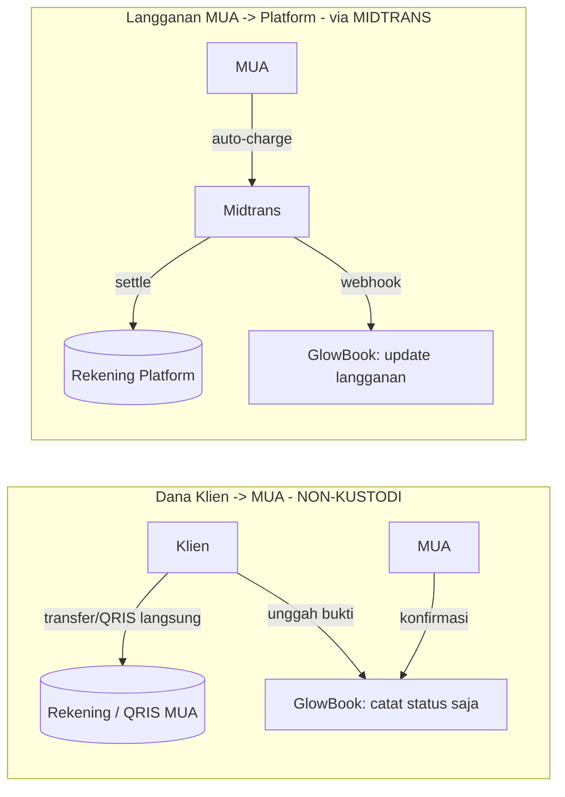

# Arsitektur Tingkat Tinggi

Ringkasan arsitektur GlowBook untuk MVP. Detail teknis final di desain engineering.

## 1. Multi-Tenancy
- **Model:** shared database, `tenant_id` pada setiap row + penegakan row-level di seluruh layer query.
- **Kepemilikan (Paket A, MVP):** **1 user : 1 tenant** via `Tenant.owner_user_id`. Multi-tenant per user = paket masa depan (tabel `Membership` + tenant switcher). Lihat [business-model.md](business-model.md).
- **Pengikatan tenant:** setiap request terikat `tenant_id` dari tenant milik user (dashboard) atau dari host/slug storefront (publik).
- **Isolasi:** user hanya mengakses tenant miliknya; tidak ada endpoint lintas tenant kecuali konsol admin (di-audit).
- **Routing storefront:** path/subdomain unik per tenant, mis. `glowbook.id/@namamua` atau `namamua.glowbook.id`.
- **Billing per tenant:** langganan, kuota order, & status `RESTRICTED` dihitung **per tenant** (lihat [F07](features/F07-langganan-midtrans.md)).

## 2. Pemisahan Dana (prinsip inti)
GlowBook memisahkan dua aliran uang secara tegas:

| Aliran | Lewat platform? | Mekanisme | Referensi |
|--------|-----------------|-----------|-----------|
| Klien → MUA (DP/pelunasan) | ❌ Tidak | Manual transfer + bukti + konfirmasi MUA | [F06](features/F06-pembayaran-klien-manual.md) |
| MUA → Platform (langganan) | ✅ Ya | Midtrans auto-charge → rekening platform | [F07](features/F07-langganan-midtrans.md) |

> **RULE-1:** platform tidak pernah menahan dana **klien**. Langganan adalah pendapatan platform sendiri — tidak melanggar RULE-1.

## 3. Komponen Logis
- **App Dashboard (MUA):** kelola storefront, layanan, jadwal, order, klien, billing.
- **Storefront Publik (Klien):** form booking, instruksi pembayaran, halaman status.
- **Konsol Admin:** moderasi reaktif, kelola plan, dukungan.
- **Layanan Notifikasi:** WhatsApp Business API (utama) + Email (fallback).
- **Integrasi Midtrans:** Snap + Subscription/Core API + webhook handler.
- **Scheduler/Worker:** hold-expiry booking, reminder, dunning langganan.

## 4. Keamanan & Kepatuhan
- Secret (server key Midtrans, kredensial WA) di secret manager; tidak pernah ke klien.
- Enkripsi at-rest untuk PII & `PaymentProfile`.
- Tidak menyimpan PAN kartu; hanya `saved_token_id` Midtrans.
- Kepatuhan UU PDP: persetujuan, hak akses/hapus, retensi data (90 hari saat restricted).
- Audit log untuk tindakan sensitif lintas tenant & admin.

## 5. Skalabilitas ke Marketplace (BR-9)
Model data tenant + storefront dirancang agar agregasi/direktori lintas tenant (Fase 4) bisa ditambahkan tanpa perombakan besar: storefront, layanan, rating, dan lokasi sudah ter-struktur dan dapat di-index.
