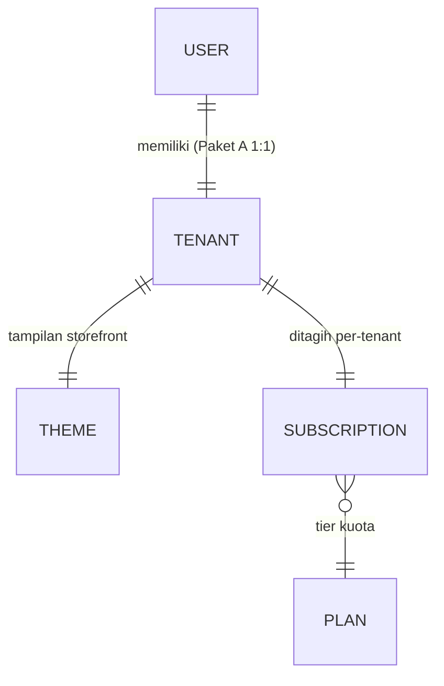

# Model Bisnis

Sumber kebenaran untuk **struktur kepemilikan** dan **monetisasi**. Mengikat [F01](features/F01-onboarding-tenant.md) (onboarding) & [F07](features/F07-langganan-midtrans.md) (langganan).

## 1. Ringkasan
- **Aktor utama:** **User (MUA)** dan **Admin (Sistem/Platform)**. User SaaS = MUA itu sendiri; Klien hanya memakai form publik (bukan user SaaS).
- **Pemisahan User & Tenant:** tabel `User` (akun login) terpisah dari `Tenant` (bisnis/storefront), agar billing & data bersih per tenant.
- **Paket A (MVP): 1 user : 1 tenant.** Saat daftar trial, sistem **langsung membuat akun `User`** lalu masuk **onboarding tenant** (membuat 1 tenant).
- **Multi-tenant per user** (1 user banyak tenant) = **paket masa depan**, di luar MVP.
- **Monetisasi:** langganan bulanan berjenjang (tier) berdasarkan **volume order**, ditagih **per tenant**, otomatis via Midtrans.
- **Tampilan storefront** dikustomisasi via **Theme per tenant**.
- **Nol kustodi dana klien** (RULE-1): DP/pelunasan klien langsung ke MUA (lihat [F06](features/F06-pembayaran-klien-manual.md)).

## 2. Struktur Kepemilikan: User ↔ Tenant

- **User** = identitas akun login (email/WA, kredensial). Aktornya adalah **MUA**.
- **Tenant** = satu bisnis MUA: storefront, layanan, jadwal, klien, theme, **langganan sendiri**.
- **Paket A (MVP):** relasi **1:1** via `Tenant.owner_user_id` — satu user punya tepat satu tenant.
- **Theme** = pengaturan tampilan storefront, **satu per tenant** (lihat [F02](features/F02-storefront-publik.md)).
- **Isolasi data per-tenant** tetap (RULE-5).

> **Ekstensi masa depan:** paket multi-tenant (1 user banyak tenant) & staf per tenant akan memakai tabel **Membership** `(user_id, tenant_id, role)` + tenant switcher. **Di luar MVP.**

### 2.1 Paket
| Paket | Rasio User:Tenant | Status |
|-------|-------------------|--------|
| **Paket A** | 1 : 1 | **MVP** |
| Paket multi-tenant | 1 : banyak | Masa depan |

## 3. Monetisasi: Langganan Tier Kuota per Volume Order

### 3.1 Prinsip
Tetap **langganan berulang** (bukan komisi per transaksi), tetapi **harga ditentukan oleh kuota jumlah order per bulan**. Ini **revisi RULE-2**: dari "satu langganan flat" menjadi "langganan berjenjang berbasis volume" — tetap langganan, **bukan** potongan per transaksi.

### 3.2 Definisi "Order" yang Dihitung
- **Order yang dihitung = booking yang `CONFIRMED`** (DP dikonfirmasi MUA → slot terkunci, lihat [F06](features/F06-pembayaran-klien-manual.md)).
- Booking `AWAITING_DP`, `EXPIRED`, atau `dibatalkan sebelum confirmed` **tidak** dihitung.
- **Satu booking = satu order**, walaupun berisi banyak layanan (multi-service).
- Penghitung (counter) **reset tiap awal periode billing**.

### 3.3 Tier & Harga *(placeholder — finalkan)*
| Tier | Kuota order / bulan | Harga / bulan |
|------|---------------------|---------------|
| **Trial** | Penuh (sementara) | Gratis, 14 hari |
| **Basic** | ≤ 30 | Rp 20.000 |
| **Pro** | 31 – 100 | Rp 50.000 |
| **Bisnis** | > 100 / unlimited | Rp 150.000 |

> Arsitektur `Plan` **[global]** menyimpan `order_quota` per tier (null = unlimited) sehingga tier/harga dapat diubah tanpa refactor.

### 3.4 Kuota, Overage & Perubahan Tier
- **Penghitung kuota** per tenant per periode; tampil di dashboard ("18 / 30 order").
- **80% kuota** → notifikasi "mendekati batas" (lihat [F08](features/F08-notifikasi.md)).
- **100% kuota tercapai** → MUA diminta **upgrade tier**.
- **Kebijakan overage (default, dapat dikonfigurasi):** **soft-block pada konfirmasi** — booking baru tetap bisa masuk sebagai `AWAITING_DP`, tetapi **mengonfirmasi order melebihi kuota memerlukan upgrade tier** (1-klik). Alternatif: auto-upgrade, atau biaya overage per order. *(Finalkan — lihat §7.)*
- **Upgrade tier:** efektif **segera** (membuka kuota); langganan Midtrans diperbarui ke nominal baru.
- **Downgrade tier:** efektif **akhir periode** (tanpa proration, konsisten dengan [F07](features/F07-langganan-midtrans.md)).

### 3.5 Trial
- **Trial 14 hari** (akses & kuota penuh). Karena **Paket A 1 user : 1 tenant**, **1 akun = 1 trial**.
- **Anti-penyalahgunaan:** verifikasi OTP nomor WA saat daftar; cegah pendaftaran berulang untuk trial ganda. *(Finalkan — lihat §7.)*

## 4. Aliran Dana
| Aliran | Lewat platform? | Mekanisme |
|--------|-----------------|-----------|
| Klien → MUA (DP/pelunasan) | ❌ Tidak (RULE-1) | Manual transfer + bukti ([F06](features/F06-pembayaran-klien-manual.md)) |
| MUA(tenant) → Platform (langganan) | ✅ Ya | Midtrans auto-charge, tier kuota ([F07](features/F07-langganan-midtrans.md)) |

## 5. Kesesuaian dengan Aturan BRD
| Aturan BRD | Status |
|-----------|--------|
| RULE-1 (nol kustodi dana klien) | **Tetap dipatuhi** — dana klien tidak lewat platform. |
| RULE-2 (langganan, bukan komisi) | **Direvisi** → langganan **berjenjang berbasis volume order**; tetap langganan, bukan komisi per transaksi. |
| RULE-5 (isolasi per tenant) | **Tetap** — billing & data per tenant. |
| RULE-6 (past-due membatasi fitur) | **Tetap** — per tenant (lihat [F07](features/F07-langganan-midtrans.md)). |

## 6. Metrik Bisnis
- **North Star:** tenant aktif berbayar.
- MRR, **ARPU per tenant** (dipengaruhi distribusi tier), distribusi tenant per tier, rasio upgrade/downgrade, trial→paid, churn per tenant.

## 7. Keputusan Terbuka
1. **Angka tier & harga** final (kuota & rupiah).
2. **Kebijakan overage** final: soft-block vs auto-upgrade vs biaya overage per order.
3. **Anti-abuse trial** (1 akun = 1 trial) — mekanisme verifikasi final.
4. Definisi billable order — tetap di `CONFIRMED`, atau `COMPLETED`?
5. Kapan membuka **paket multi-tenant** (1 user banyak tenant) & model harganya.
