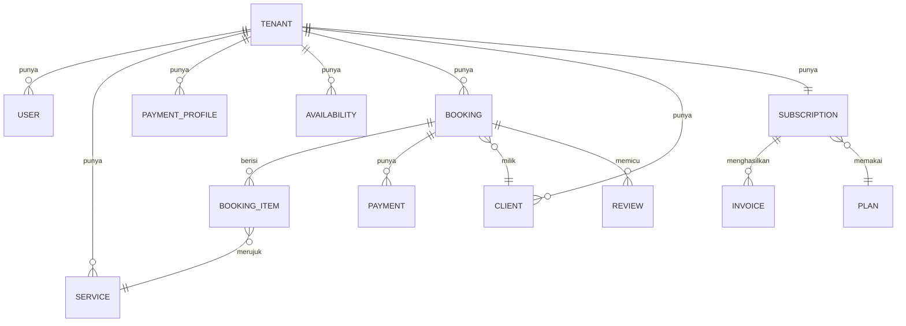

# Model Data

Entitas inti GlowBook (MVP). Semua entitas **tenant-scoped** kecuali ditandai **[global]**. Tipe & index final di desain teknis.

## 1. Diagram Relasi (ringkas)

## 2. Entitas

### Tenant & Pengguna
- **Tenant** `id, slug, nama_bisnis, kota, status(active|trial|past_due|restricted|canceled), created_at`
- **User** `id, tenant_id, role(owner|staff|admin), email, phone, auth_*`

### Storefront & Katalog
- **PaymentProfile** `id, tenant_id, jenis(bank|qris|ewallet), bank_nama, no_rekening, atas_nama, qris_image_url, instruksi_tambahan, is_active` — *instruksi bayar MUA, non-kustodi*
- **Service** `id, tenant_id, nama, deskripsi, harga, durasi_menit, dp_tipe(persen|nominal), dp_nilai, butuh_transport, aktif`
- **TransportRule** `id, tenant_id, mode(flat|zona), flat_nominal, zona[{nama, nominal}]`
- **CustomField** `id, tenant_id, label, tipe(text|select|date|file), wajib, opsi[]`
- **Portfolio** `id, tenant_id, image_url, caption, urutan`

### Jadwal
- **Availability** `id, tenant_id, hari, jam_mulai, jam_selesai, slot_durasi, kapasitas`
- **BlockedDate** `id, tenant_id, tanggal/range, alasan`

### Booking & Klien
- **Booking** `id, tenant_id, kode, client_id, tanggal, jam_mulai, jam_selesai, status, subtotal, transport_fee, total, dp_amount, sisa_amount, lokasi, custom_values{}, hold_expires_at, created_at`
- **BookingItem** `id, booking_id, service_id, qty, harga_snapshot`
- **Client** `id, tenant_id, nama, phone, email, catatan, total_booking, created_at`

### Pembayaran Klien (manual, non-kustodi)
- **Payment** `id, tenant_id, booking_id, jenis(dp|pelunasan), metode, amount, proof_url, status(menunggu|diajukan|dikonfirmasi|ditolak), submitted_at, confirmed_at, confirmed_by`

### Langganan (Midtrans)
- **Plan** **[global]** `id, nama, harga, interval(monthly), fitur{}, aktif`
- **Subscription** `id, tenant_id, plan_id, status(trialing|active|past_due|canceled|expired), trial_end, current_period_start, current_period_end, midtrans_subscription_id, saved_token_id, payment_method, retry_count`
- **Invoice** `id, tenant_id, subscription_id, periode, amount, status(paid|pending|failed), midtrans_order_id, paid_at, pdf_url`

### Pendukung
- **Review** `id, tenant_id, booking_id, rating(1-5), komentar, status(published|flagged|hidden), created_at`
- **Notification** `id, tenant_id, kanal(wa|email), template, target, payload, status, sent_at`
- **AuditLog** **[global]** `id, actor, tenant_id, aksi, entity, before, after, at`

## 3. Status Penting (lihat dokumen fitur)
- Booking lifecycle → [F04](features/F04-booking-mandiri.md), [F05](features/F05-kalender-anti-bentrok.md)
- Payment (klien) lifecycle → [F06](features/F06-pembayaran-klien-manual.md)
- Subscription lifecycle → [F07](features/F07-langganan-midtrans.md)
