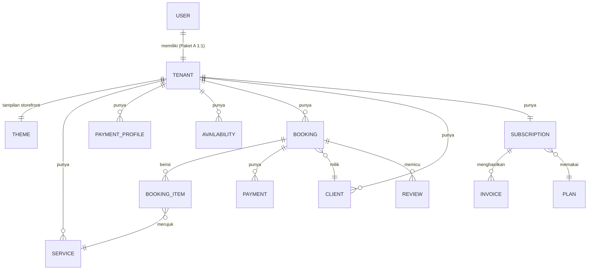

# Model Data

Entitas inti GlowBook (MVP). Semua entitas **tenant-scoped** kecuali ditandai **[global]**. Tipe & index final di desain teknis.

## 1. Diagram Relasi (ringkas)

## 2. Entitas

### Akun & Tenant *(Paket A: 1 user : 1 tenant)*
> **Paket A (MVP): 1 user memiliki tepat 1 tenant** (relasi 1:1 via `owner_user_id`). Multi-tenant per user = paket masa depan (tabel `Membership`, di luar MVP). Lihat [business-model.md](business-model.md).
- **User** `id, email, phone, auth_*, timezone?, created_at` — identitas akun login (aktor = MUA). `timezone` **opsional/nullable** untuk sekarang (mis. `Asia/Makassar`); jadwal default mengikuti kota tenant (lihat [F05](features/F05-kalender-anti-bentrok.md)).
- **Tenant** `id, owner_user_id, slug, nama_bisnis, kota, status(ACTIVE|TRIAL|PAST_DUE|RESTRICTED|CANCELED), created_at`

### Storefront & Katalog
- **Theme** `id, tenant_id, logo_url, banner_url, warna_primer, warna_sekunder, font, template(layout), custom_css?, updated_at` — **tampilan storefront, 1 per tenant** (lihat [F02](features/F02-storefront-publik.md)).
- **PaymentProfile** `id, tenant_id, jenis(bank|qris|ewallet), bank_nama, no_rekening, atas_nama, qris_image_url, instruksi_tambahan, is_active` — *instruksi bayar MUA, non-kustodi*
- **Service** `id, tenant_id, nama, deskripsi, harga, durasi_menit, dp_tipe(persen|nominal), dp_nilai, butuh_transport, aktif`
- **TransportRule** `id, tenant_id, mode(flat|zona), flat_nominal, zona[{nama, nominal}]`
- **CustomField** `id, tenant_id, label, tipe(text|select|date|file), wajib, opsi[]`
- **Portfolio** `id, tenant_id, image_url, caption, urutan`

### Jadwal
- **Availability** `id, tenant_id, hari(Int 0=Minggu..6=Sabtu), jam_mulai(Int, menit sejak 00:00), jam_selesai(Int, menit sejak 00:00), slot_durasi(Int, menit), kapasitas(Int, default 1)` — unique `(tenant_id, hari)`: satu window jam kerja per hari per tenant di MVP (multi-window/hari = ekstensi masa depan).
- **BlockedDate** `id, tenant_id, tanggal_mulai(Date), tanggal_selesai(Date), alasan?` — rentang inklusif; satu hari = `tanggal_mulai = tanggal_selesai`. Index `(tenant_id, tanggal_mulai, tanggal_selesai)` untuk query overlap.

### Booking & Klien
- **Booking** `id, tenant_id, kode, client_id, tanggal_acara, status(AWAITING_DP|CONFIRMED|PAID|COMPLETED|CANCELED|EXPIRED), subtotal, transport_fee, total, dp_amount, sisa_amount, lokasi, custom_values{}, hold_expires_at, created_at` — **tidak menyimpan jam_mulai/jam_selesai sendiri**: jendela hari kerja berasal dari `Availability(tenant_id, hari)`, durasi dihitung dari Σ `BookingItem.durasi`.
- **BookingItem** `id, booking_id, service_id, qty, harga_snapshot`
- **Client** `id, tenant_id, nama, phone, email, catatan, total_booking, created_at`

### Pembayaran Klien (manual, non-kustodi)
- **Payment** `id, tenant_id, booking_id, jenis(dp|pelunasan), metode, amount, proof_url, status(PENDING|SUBMITTED|CONFIRMED|REJECTED), submitted_at, confirmed_at, confirmed_by`

### Langganan (Midtrans, tier kuota per volume order)
- **Plan** **[global]** `id, nama(tier), harga, interval(monthly), order_quota(null=unlimited), tier_urutan, fitur{}, aktif`
- **Subscription** `id, tenant_id, plan_id, status(TRIALING|ACTIVE|PAST_DUE|CANCELED|EXPIRED), trial_end, current_period_start, current_period_end, orders_used_period, midtrans_subscription_id, saved_token_id, payment_method, retry_count` — `orders_used_period` = penghitung order `CONFIRMED` periode berjalan (reset tiap siklus).
- **Invoice** `id, tenant_id, subscription_id, periode, amount, status(PAID|PENDING|FAILED), midtrans_order_id, paid_at, pdf_url`

### Pendukung
- **Review** `id, tenant_id, booking_id, rating(1-5), komentar, status(PUBLISHED|FLAGGED|HIDDEN), created_at`
- **Notification** `id, tenant_id, kanal(wa|email), template, target, payload, status(QUEUED|SENT|DELIVERED|FAILED), sent_at`
- **StorefrontReport** `id, tenant_id, alasan, kontak?, status(OPEN|REVIEWED|DISMISSED), created_at` — report/flag storefront publik oleh pengunjung (F02, FR-F02-5), dikonsumsi alur moderasi reaktif admin (F12, US-F12-2). `alasan` teks bebas dari pelapor (batasi panjang di DTO BE); `kontak` opsional untuk follow-up.
- **AuditLog** **[global]** `id, actor, tenant_id, aksi, entity, before, after, at`

## 3. Status Penting (lihat dokumen fitur)
- Booking lifecycle → [F04](features/F04-booking-mandiri.md), [F05](features/F05-kalender-anti-bentrok.md)
- Payment (klien) lifecycle → [F06](features/F06-pembayaran-klien-manual.md)
- Subscription lifecycle → [F07](features/F07-langganan-midtrans.md)
