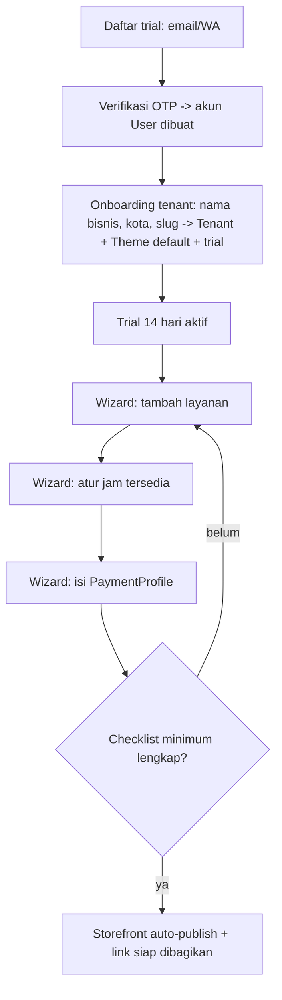

# F01 — Onboarding Tenant & Setup Awal

| Atribut | Nilai |
|---------|-------|
| **ID** | F01 |
| **Rilis** | R1 |
| **Modul PRD** | §6.1 |
| **Kebutuhan Bisnis** | BR-1, BR-7 |
| **Status** | Draft |
| **Dependensi** | — |

## 1. Tujuan
Membuat **MUA mendaftar trial** → sistem **langsung membuat akun `User`** dan masuk ke **onboarding tenant** (Paket A: **1 user : 1 tenant**), menyelesaikan **setup minimum** sehingga storefront otomatis tayang & siap menerima booking — tanpa keahlian teknis. Struktur kepemilikan di [business-model.md](../business-model.md).

## 2. User Stories
- **US-F01-1:** Sebagai MUA, saya mendaftar trial dengan email/nomor WA + verifikasi OTP; sistem **langsung membuat akun saya**.
- **US-F01-2:** Sebagai MUA, saya **langsung masuk onboarding tenant** (1 tenant) — isi nama bisnis, kota, slug — dan mendapat trial 14 hari **tanpa kartu**.
- **US-F01-3:** Sebagai MUA, saya dipandu wizard setup minimum: ≥1 layanan, jam tersedia, dan instruksi pembayaran (PaymentProfile).
- **US-F01-4:** Sebagai MUA, begitu setup minimum selesai, saya mendapat link storefront yang bisa langsung dibagikan ke bio IG.

## 3. Kebutuhan Fungsional (FR)
- **FR-F01-1:** Registrasi trial → buat **akun `User`** via email/WA + verifikasi OTP, **lalu langsung lanjut ke onboarding tenant**.
- **FR-F01-2:** Buat tenant (Paket A, 1:1) → `Tenant(owner_user_id=User.id)` + **`Theme` default** + `Subscription(status=TRIALING, trial_end=now+14 hari)`.
- **FR-F01-3:** Validasi slug storefront unik (huruf kecil, angka, tanda hubung).
- **FR-F01-4:** Wizard setup berlangkah dengan indikator progres & checklist "siap tayang".
- **FR-F01-5:** Storefront **auto-publish** saat checklist minimum terpenuhi (≥1 layanan aktif, jam tersedia, ≥1 PaymentProfile aktif).
- **FR-F01-6:** Tampilkan sisa hari trial di dashboard; reminder berlangganan mulai H-3 (lihat [F07](F07-langganan-midtrans.md)).
- **FR-F01-7:** **Paket A — 1 user : 1 tenant**: satu akun memiliki tepat satu tenant. (Multi-tenant per user = paket masa depan, di luar MVP.)
- **FR-F01-8:** **Anti-abuse trial:** **1 akun = 1 trial** (verifikasi OTP nomor WA); cegah pendaftaran berulang untuk trial ganda (lihat [business-model.md](../business-model.md) §3.5).

## 4. Alur Pengguna (UX Flow)

## 5. Aturan & Logika Bisnis
- Trial tidak meminta metode pembayaran di muka.
- **Paket A: 1 user : 1 tenant** — akun & tenant dibuat dalam satu alur daftar.
- Trial, langganan, kuota, & status berlaku **per tenant**.
- Setiap tenant memiliki **Theme default** yang dapat dikustomisasi (lihat [F02](F02-storefront-publik.md)).
- Slug bersifat permanen-default; perubahan slug membuat redirect dari slug lama (hindari link mati di bio IG).
- Selama trial, **semua fitur MVP aktif** dengan kuota penuh (lihat [F07](F07-langganan-midtrans.md)).

## 6. Data Terkait
`User`, `Tenant`, `Theme`, `Service` (F03), `Availability` (F05), `PaymentProfile` (F06), `Subscription` (F07).

## 7. API / Endpoint (indikatif)
- `POST /auth/register` · `POST /auth/verify-otp`
- `POST /tenants` (buat tenant + slug)
- `GET /onboarding/checklist`
- `POST /storefront/publish` (otomatis dipicu saat checklist lengkap)

## 8. Status / State Machine
`Subscription` per tenant: `TRIALING → ACTIVE` (saat berlangganan) atau `TRIALING → EXPIRED` (trial habis tanpa bayar). Lihat [F07](F07-langganan-midtrans.md) untuk transisi langganan lengkap.

## 9. Edge Case
- Slug sudah dipakai → sarankan alternatif.
- OTP gagal/expired → kirim ulang dengan rate-limit.
- Setup ditinggal separuh jalan → simpan progres; storefront tetap belum tayang sampai minimum lengkap.
- Pendaftaran berulang untuk trial ganda → anti-abuse **1 akun = 1 trial** (FR-F01-8).

## 10. Kriteria Penerimaan (AC)
- **AC-F01-1:** Registrasi → trial aktif 14 hari tanpa kartu.
- **AC-F01-2:** Storefront tayang otomatis hanya setelah checklist minimum (layanan + jam + PaymentProfile) terpenuhi.
- **AC-F01-3:** Slug unik tervalidasi dan menghasilkan URL publik yang dapat diakses tanpa login.
- **AC-F01-4:** Daftar trial membuat **akun `User` + 1 tenant (Paket A 1:1)** dalam satu alur, lengkap dengan `Theme` default dan `Subscription` berstatus `TRIALING`.

## 11. Di Luar Lingkup Fitur
- **Multi-tenant per user / tenant switcher** (paket masa depan).
- Multi-user/staf per tenant (fase lanjutan).
- Import data dari spreadsheet eksternal.

## 12. Metrik
`signup`, `trial_started`, `storefront_published`, waktu signup→publish.
