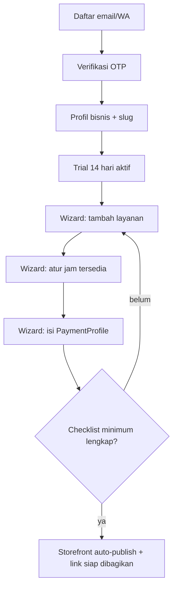

# F01 — Onboarding Tenant & Setup Awal

| Atribut | Nilai |
|---------|-------|
| **ID** | F01 |
| **Rilis** | R1 |
| **Modul PRD** | §6.1 |
| **Kebutuhan Bisnis** | BR-1, BR-7 |
| **Status** | Draft |
| **Dependensi** | — |

## 1. Tujuan
Membuat MUA bisa mendaftar, memperoleh **free trial 14 hari**, dan menyelesaikan **setup minimum** sehingga storefront otomatis tayang dan siap menerima booking — secepat mungkin, tanpa keahlian teknis.

## 2. User Stories
- **US-F01-1:** Sebagai MUA, saya mendaftar dengan email/nomor WA dan verifikasi OTP.
- **US-F01-2:** Sebagai MUA, saya mengisi profil bisnis (nama, kota, slug storefront) dan langsung mendapat trial 14 hari **tanpa kartu**.
- **US-F01-3:** Sebagai MUA, saya dipandu wizard untuk setup minimum: ≥1 layanan, jam tersedia, dan instruksi pembayaran (PaymentProfile).
- **US-F01-4:** Sebagai MUA, begitu setup minimum selesai, saya mendapat link storefront yang bisa langsung dibagikan ke bio IG.

## 3. Kebutuhan Fungsional (FR)
- **FR-F01-1:** Registrasi via email atau nomor WA + verifikasi OTP.
- **FR-F01-2:** Buat `Tenant` + `User(owner)`; set `status = trial`, `trial_end = now + 14 hari`.
- **FR-F01-3:** Validasi slug storefront unik (huruf kecil, angka, tanda hubung).
- **FR-F01-4:** Wizard setup berlangkah dengan indikator progres & checklist "siap tayang".
- **FR-F01-5:** Storefront **auto-publish** saat checklist minimum terpenuhi (≥1 layanan aktif, jam tersedia, ≥1 PaymentProfile aktif).
- **FR-F01-6:** Tampilkan sisa hari trial di dashboard; reminder berlangganan mulai H-3 (lihat [F07](F07-langganan-midtrans.md)).

## 4. Alur Pengguna (UX Flow)

## 5. Aturan & Logika Bisnis
- Trial tidak meminta metode pembayaran di muka.
- Slug bersifat permanen-default; perubahan slug membuat redirect dari slug lama (hindari link mati di bio IG).
- Selama trial, **semua fitur MVP aktif** (lihat [F07](F07-langganan-midtrans.md)).

## 6. Data Terkait
`Tenant`, `User`, `Service` (F03), `Availability` (F05), `PaymentProfile` (F06), `Subscription` (F07).

## 7. API / Endpoint (indikatif)
- `POST /auth/register` · `POST /auth/verify-otp`
- `POST /tenants` (buat tenant + slug)
- `GET /onboarding/checklist`
- `POST /storefront/publish` (otomatis dipicu saat checklist lengkap)

## 8. Status / State Machine
Tenant: `trial → active` (saat berlangganan) atau `trial → expired` (trial habis tanpa bayar). Lihat [F07](F07-langganan-midtrans.md) untuk transisi langganan.

## 9. Edge Case
- Slug sudah dipakai → sarankan alternatif.
- OTP gagal/expired → kirim ulang dengan rate-limit.
- Setup ditinggal separuh jalan → simpan progres; storefront tetap belum tayang sampai minimum lengkap.

## 10. Kriteria Penerimaan (AC)
- **AC-F01-1:** Registrasi → trial aktif 14 hari tanpa kartu.
- **AC-F01-2:** Storefront tayang otomatis hanya setelah checklist minimum (layanan + jam + PaymentProfile) terpenuhi.
- **AC-F01-3:** Slug unik tervalidasi dan menghasilkan URL publik yang dapat diakses tanpa login.

## 11. Di Luar Lingkup Fitur
- Multi-user/staf per tenant (fase lanjutan).
- Import data dari spreadsheet eksternal.

## 12. Metrik
`signup`, `trial_started`, `storefront_published`, waktu signup→publish.
