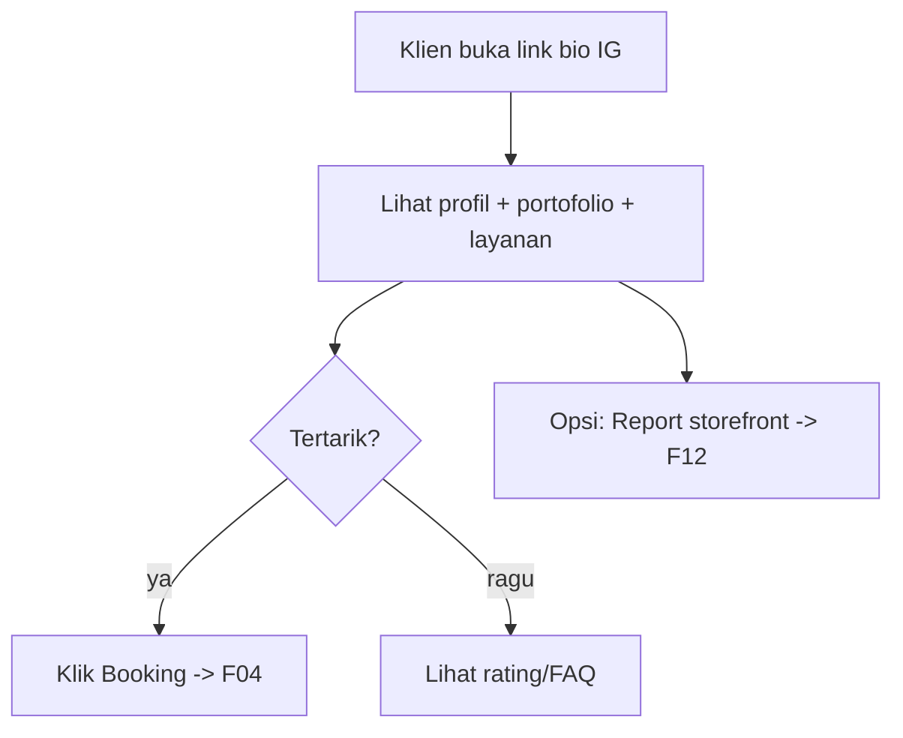

# F02 — Storefront / Form Publik

| Atribut | Nilai |
|---------|-------|
| **ID** | F02 |
| **Rilis** | R1 |
| **Modul PRD** | §6.2 |
| **Kebutuhan Bisnis** | BR-1, BR-2, BR-10 |
| **Status** | Draft |
| **Dependensi** | F01, F03 |

## 1. Tujuan
Halaman publik per tenant yang bisa dibagikan di bio IG/WA, menampilkan profil MUA, layanan, harga transparan, portofolio, dan tombol booking — tanpa klien perlu DM atau login.

## 2. User Stories
- **US-F02-1:** Sebagai klien, saya membuka link storefront dan langsung melihat layanan + harga tanpa harus bertanya.
- **US-F02-2:** Sebagai klien, saya melihat portofolio & rating untuk menilai kredibilitas MUA.
- **US-F02-3:** Sebagai MUA, storefront saya tayang otomatis dan tampil profesional di HP klien.
- **US-F02-4:** Sebagai pengguna, saya bisa melaporkan (flag) storefront yang melanggar.
- **US-F02-5:** Sebagai MUA, saya mengkustomisasi tampilan storefront (logo, banner, warna, font) lewat **Theme**.

## 3. Kebutuhan Fungsional (FR)
- **FR-F02-1:** Render publik berbasis slug/subdomain; dapat diakses tanpa autentikasi.
- **FR-F02-2:** Tampilkan: branding (nama, logo, kota), portofolio, daftar layanan (harga, durasi), aturan transport, FAQ, rating ringkas.
- **FR-F02-3:** CTA "Booking" menuju alur [F04](F04-booking-mandiri.md).
- **FR-F02-4:** **Auto-publish** (BR-10) saat setup minimum lengkap; status publish dapat dimatikan otomatis saat langganan `RESTRICTED` (lihat [F07](F07-langganan-midtrans.md)).
- **FR-F02-5:** Tombol **report/flag** untuk moderasi reaktif (lihat [F12](F12-admin-moderasi.md)).
- **FR-F02-6:** Mobile-first, muat < 2 detik di 4G; meta/Open Graph untuk preview saat link dibagikan.
- **FR-F02-7:** Tampilan storefront dirender dari **`Theme` per tenant** (logo, banner, warna primer/sekunder, font, template/layout); MUA dapat mengkustomisasi tema di dashboard. Tenant baru mendapat **Theme default** (lihat [F01](F01-onboarding-tenant.md)).

## 4. Alur Pengguna (UX Flow)

## 5. Aturan & Logika Bisnis
- Storefront `RESTRICTED`/langganan past-due melewati grace → tampilkan halaman "sementara tidak aktif" (lihat [F07](F07-langganan-midtrans.md)).
- Data yang ditampilkan selalu real-time dari katalog & ketersediaan tenant.

## 6. Data Terkait
`Tenant`, `Theme`, `Service` (F03), `Portfolio`, `TransportRule`, `Review` (F11), `Subscription.status` (F07).

## 7. API / Endpoint (indikatif)
- `GET /s/{slug}` (render storefront publik)
- `GET /s/{slug}/services`
- `POST /s/{slug}/report`

## 8. Status / State Machine
Storefront: `unpublished → published` (auto saat minimum lengkap) ↔ `suspended` (restricted/moderasi).

## 9. Edge Case
- Slug tidak ditemukan → halaman 404 ramah.
- Tenant restricted → halaman nonaktif, bukan error.
- Portofolio kosong → tampilkan placeholder, tetap bisa booking.

## 10. Kriteria Penerimaan (AC)
- **AC-F02-1:** Storefront dapat diakses publik via slug tanpa login.
- **AC-F02-2:** Harga & ketersediaan yang tampil selalu konsisten dengan katalog tenant.
- **AC-F02-3:** Saat tenant restricted, storefront menampilkan status nonaktif, bukan crash/404.

## 11. Di Luar Lingkup Fitur
- Kustomisasi tema/branding lanjutan.
- Direktori/pencarian lintas tenant (marketplace, Fase 4).

## 12. Metrik
Kunjungan storefront, konversi kunjungan→booking, rasio share link.
