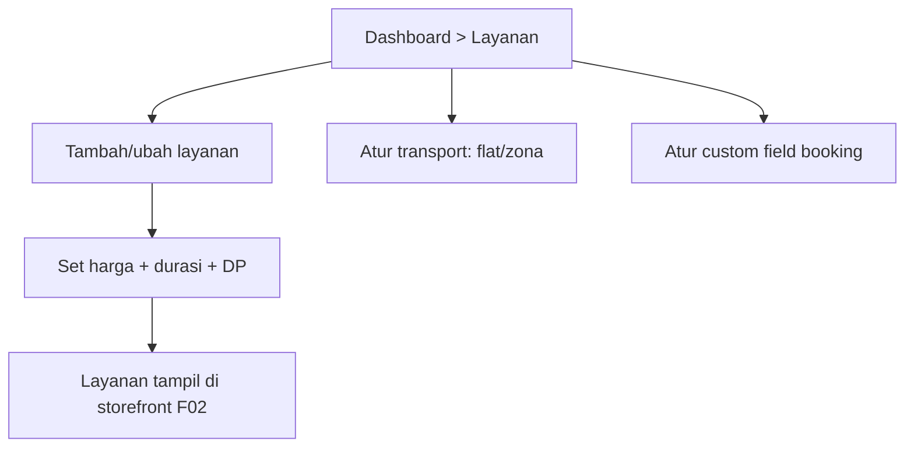

# F03 — Katalog Layanan, Transport & Custom Field

| Atribut | Nilai |
|---------|-------|
| **ID** | F03 |
| **Rilis** | R1 |
| **Modul PRD** | §6.3 |
| **Kebutuhan Bisnis** | BR-1 |
| **Status** | Draft |
| **Dependensi** | F01 |

## 1. Tujuan
Memungkinkan MUA menyusun katalog layanan (harga, durasi, DP), aturan transport, dan pertanyaan booking khusus (lokasi, adat, jumlah orang) — fondasi yang dipakai storefront ([F02](F02-storefront-publik.md)) dan booking ([F04](F04-booking-mandiri.md)).

## 2. User Stories
- **US-F03-1:** Sebagai MUA, saya membuat layanan dengan nama, harga, durasi, dan **DP per layanan** (persen atau nominal).
- **US-F03-2:** Sebagai MUA, saya menetapkan aturan transport (flat atau per-zona) yang ditambahkan ke total.
- **US-F03-3:** Sebagai MUA, saya menambah custom field (mis. "alamat acara", "adat", "jumlah orang").
- **US-F03-4:** Sebagai klien, saya bisa memesan **beberapa layanan dalam satu booking** (mis. wisuda grup, pengantin + family).

## 3. Kebutuhan Fungsional (FR)
- **FR-F03-1:** CRUD `Service` (nama, deskripsi, harga, durasi_menit, dp_tipe, dp_nilai, butuh_transport, aktif).
- **FR-F03-2:** **DP per layanan**: persen (mis. 30%) atau nominal tetap.
- **FR-F03-3:** `TransportRule` mode `flat` (satu nominal) atau `zona` (daftar {nama, nominal}).
- **FR-F03-4:** CRUD `CustomField` (label, tipe text/select/date/file, wajib/opsional, opsi[]).
- **FR-F03-5:** Dukung **multi-layanan per booking** sebagai line item (`BookingItem`), masing-masing dengan `harga_snapshot`.
- **FR-F03-6:** Nonaktifkan layanan tanpa menghapus (jaga riwayat order lama).

## 4. Alur Pengguna (UX Flow)

## 5. Aturan & Logika Bisnis
- Saat booking dibuat, harga disnapshot ke `BookingItem.harga_snapshot` agar perubahan harga tidak mengubah order lama.
- Total booking = Σ(harga_snapshot × qty) + transport_fee.
- DP booking = agregasi DP per layanan (atau aturan default tenant — finalkan di desain).

## 6. Data Terkait
`Service`, `TransportRule`, `CustomField`, `BookingItem` (F04).

## 7. API / Endpoint (indikatif)
- `GET/POST/PUT/DELETE /services`
- `GET/PUT /transport-rules`
- `GET/POST/PUT/DELETE /custom-fields`

## 8. Status / State Machine
`Service.aktif`: `aktif ↔ nonaktif`. Layanan nonaktif tak muncul di storefront tapi tetap dirujuk order historis.

## 9. Edge Case
- Hapus layanan yang dipakai order aktif → cegah/soft-delete (nonaktifkan).
- Zona transport kosong padahal layanan `butuh_transport` → validasi sebelum publish.
- Custom field tipe `file` → batasi ukuran/format.

## 10. Kriteria Penerimaan (AC)
- **AC-F03-1:** DP per layanan dihitung benar (persen & nominal).
- **AC-F03-2:** Transport flat & per-zona terhitung benar di total booking.
- **AC-F03-3:** Multi-layanan dalam satu booking tercatat sebagai line item dengan harga ter-snapshot.

## 11. Di Luar Lingkup Fitur
- Transport berbasis jarak/Maps per-km (dipertimbangkan iterasi berikut).
- Paket/bundling harga dinamis & diskon.

## 12. Metrik
Jumlah layanan per tenant, layanan terlaris (dari order), % booking multi-layanan.
