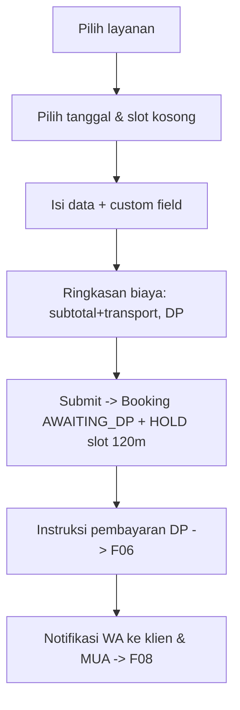

# F04 — Booking Mandiri oleh Klien

| Atribut | Nilai |
|---------|-------|
| **ID** | F04 |
| **Rilis** | R1 |
| **Modul PRD** | §6.4 |
| **Kebutuhan Bisnis** | BR-2, BR-3 |
| **Status** | Draft |
| **Dependensi** | F02, F03, F05 |

## 1. Tujuan
Memungkinkan klien memesan sendiri 24/7 lewat form publik: pilih layanan, lihat slot kosong, isi detail, dan menerima instruksi pembayaran DP — tanpa akun berat dan tanpa DM manual.

## 2. User Stories
- **US-F04-1:** Sebagai klien, saya memilih satu/beberapa layanan dan melihat ringkasan biaya (subtotal + transport + DP).
- **US-F04-2:** Sebagai klien, saya hanya melihat tanggal & slot yang benar-benar tersedia (anti-bentrok, lihat [F05](F05-kalender-anti-bentrok.md)).
- **US-F04-3:** Sebagai klien, saya mengisi data diri + custom field (lokasi/adat) lalu submit tanpa membuat akun.
- **US-F04-4:** Sebagai klien, setelah submit saya menerima **instruksi pembayaran DP** dan slot di-hold sementara.
- **US-F04-5:** Sebagai klien, saya bisa membuka **halaman status booking** via kode + OTP WA.

## 3. Kebutuhan Fungsional (FR)
- **FR-F04-1:** Pemilih layanan multi-pilih → `BookingItem`.
- **FR-F04-2:** Hitung biaya real-time: subtotal + transport (F03) + DP.
- **FR-F04-3:** Pemilih tanggal/slot menampilkan hanya slot tersedia dari [F05](F05-kalender-anti-bentrok.md).
- **FR-F04-4:** Form data klien (nama, WA, email opsional) + custom field wajib/opsional.
- **FR-F04-5:** Saat submit: buat `Booking(status=AWAITING_DP)`, buat/tautkan `Client`, **hold slot** (`hold_expires_at = now + 120 menit`).
- **FR-F04-6:** Tampilkan instruksi pembayaran DP dari `PaymentProfile` (lihat [F06](F06-pembayaran-klien-manual.md)).
- **FR-F04-7:** Halaman status booking publik via kode booking + verifikasi OTP WA.
- **FR-F04-8:** Identifikasi klien ringan (tanpa password) — verifikasi berbasis nomor WA.

## 4. Alur Pengguna (UX Flow)

## 5. Aturan & Logika Bisnis
- Slot di-hold saat submit; **belum** mengunci permanen sampai DP dikonfirmasi MUA (lihat [F06](F06-pembayaran-klien-manual.md)).
- Hold kedaluwarsa → booking `EXPIRED`, slot dilepas (worker, lihat [F05](F05-kalender-anti-bentrok.md)).
- Harga di-snapshot saat submit (F03).

## 6. Data Terkait
`Booking`, `BookingItem`, `Client`, `Service` (F03), `PaymentProfile` (F06), `Availability` (F05).

## 7. API / Endpoint (indikatif)
- `GET /s/{slug}/slots?date=...`
- `POST /s/{slug}/bookings` (buat booking + hold)
- `GET /bookings/{kode}` (halaman status, perlu OTP)
- `POST /bookings/{kode}/verify-otp`

## 8. Status / State Machine
Booking awal: `AWAITING_DP`. Transisi penuh dibahas di [F05](F05-kalender-anti-bentrok.md) (hold/expired) dan [F06](F06-pembayaran-klien-manual.md) (confirmed/lunas).

## 9. Edge Case
- Dua klien memilih slot sama bersamaan → yang pertama submit mendapat hold; yang kedua melihat slot tak tersedia (lihat [F05](F05-kalender-anti-bentrok.md)).
- Klien menutup halaman sebelum bayar → booking tetap `AWAITING_DP` sampai hold habis.
- Custom field wajib kosong → validasi blokir submit.
- Spam booking → rate-limit per nomor WA/IP.

## 10. Kriteria Penerimaan (AC)
- **AC-F04-1:** Hanya slot tersedia yang bisa dipilih; submit pada slot ter-hold/terisi ditolak.
- **AC-F04-2:** Booking tersimpan dengan biaya & DP terhitung benar dan slot ter-hold 120 menit.
- **AC-F04-3:** Klien dapat membuka status booking tanpa akun, hanya via kode + OTP.

## 11. Di Luar Lingkup Fitur
- Pembayaran DP otomatis via gateway (manual saja, lihat [F06](F06-pembayaran-klien-manual.md)).
- Akun klien penuh / login sosial.

## 12. Metrik
`booking_created`, rasio submit→DP dibayar, abandonment di tiap langkah, jumlah hold expired.
