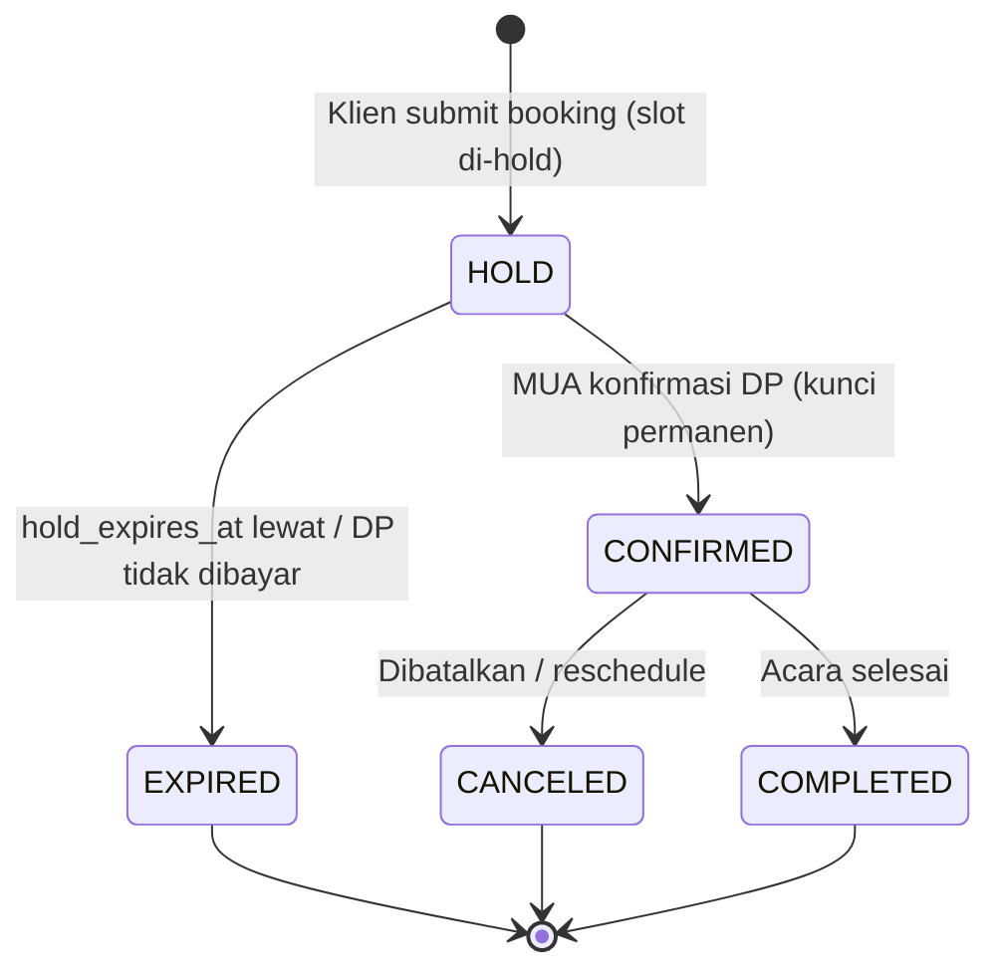

# F05 — Kalender & Anti-Bentrok

| Atribut | Nilai |
|---------|-------|
| **ID** | F05 |
| **Rilis** | R1 |
| **Modul PRD** | §6.5 |
| **Kebutuhan Bisnis** | BR-3, RULE-3 |
| **Status** | Draft |
| **Dependensi** | F01 |

## 1. Tujuan
Menjamin **tidak ada double-book**: hitung slot tersedia dari jam kerja MUA dikurangi tanggal diblokir, booking terkonfirmasi, dan hold sementara. Mengunci kalender otomatis saat booking dikonfirmasi.

## 2. User Stories
- **US-F05-1:** Sebagai MUA, saya menetapkan jam tersedia per hari & durasi slot.
- **US-F05-2:** Sebagai MUA, saya memblokir tanggal tertentu (libur, sudah ada acara luar sistem).
- **US-F05-3:** Sebagai klien, saya tidak pernah bisa memesan slot yang sudah ter-hold/terisi.
- **US-F05-4:** Sebagai MUA, slot otomatis terkunci saat saya konfirmasi DP, tanpa input manual.

## 3. Kebutuhan Fungsional (FR)
- **FR-F05-1:** CRUD `Availability` (hari, jam_mulai, jam_selesai, slot_durasi, kapasitas).
- **FR-F05-2:** CRUD `BlockedDate` (tanggal/range, alasan).
- **FR-F05-3:** Perhitungan slot tersedia = `Availability` − `BlockedDate` − booking `CONFIRMED` − **hold aktif** (`hold_expires_at > now`).
- **FR-F05-4:** **Hold sementara** saat booking dibuat (default 120 menit, dapat dikonfigurasi).
- **FR-F05-5:** **Worker pelepas hold:** booking `AWAITING_DP` yang `hold_expires_at` lewat → set `EXPIRED`, lepas slot.
- **FR-F05-6:** Penguncian permanen saat booking → `CONFIRMED` (dipicu konfirmasi DP, lihat [F06](F06-pembayaran-klien-manual.md)).
- **FR-F05-7:** Cegah race condition: penguncian slot harus atomik (transaksi/locking).
- **FR-F05-8:** Tampilan kalender di dashboard MUA (hari/minggu/bulan) dengan status booking.

## 4. Alur & State (Booking dari sisi slot)

## 5. Aturan & Logika Bisnis
- Satu slot tidak boleh punya lebih dari `kapasitas` booking aktif (default 1).
- Hold dan confirmed sama-sama memblokir slot; hanya confirmed yang permanen.
- Reschedule (lihat [F09](F09-manajemen-order-klien.md)) harus tetap melewati cek anti-bentrok pada slot tujuan.
- Durasi booking = Σ durasi layanan; slot harus muat durasi total.

## 6. Data Terkait
`Availability`, `BlockedDate`, `Booking(status, hold_expires_at)`.

## 7. API / Endpoint (indikatif)
- `GET/PUT /availability`
- `GET/POST/DELETE /blocked-dates`
- `GET /s/{slug}/slots?date=...` (publik)
- `GET /calendar?range=...` (dashboard)

## 8. Status / State Machine
Lihat diagram §4. Status booking: `AWAITING_DP(hold) → CONFIRMED → COMPLETED`, atau `→ EXPIRED`/`→ CANCELED`.

## 9. Edge Case
- Dua submit bersamaan pada slot sama → hanya satu berhasil (locking atomik), satunya gagal dengan pesan "slot baru saja terisi".
- MUA blokir tanggal yang sudah ada booking confirmed → tolak / minta pindahkan booking dulu.
- Zona waktu: gunakan WIB/WITA/WIT sesuai kota tenant; simpan konsisten.
- Durasi layanan melebihi slot tersedia → tidak ditawarkan.

## 10. Kriteria Penerimaan (AC)
- **AC-F05-1:** Tidak ada dua booking aktif pada slot yang sama (diuji dengan submit bersamaan).
- **AC-F05-2:** Hold otomatis lepas setelah kedaluwarsa dan slot kembali tersedia.
- **AC-F05-3:** Konfirmasi DP mengunci slot permanen tanpa input jadwal manual.

## 11. Di Luar Lingkup Fitur
- Sinkronisasi Google Calendar (potensi iterasi berikut).
- Multi-staf/multi-kursi paralel (fase lanjutan).

## 12. Metrik
Jumlah double-book (target 0, OBJ-3), jumlah hold expired, utilisasi slot.
