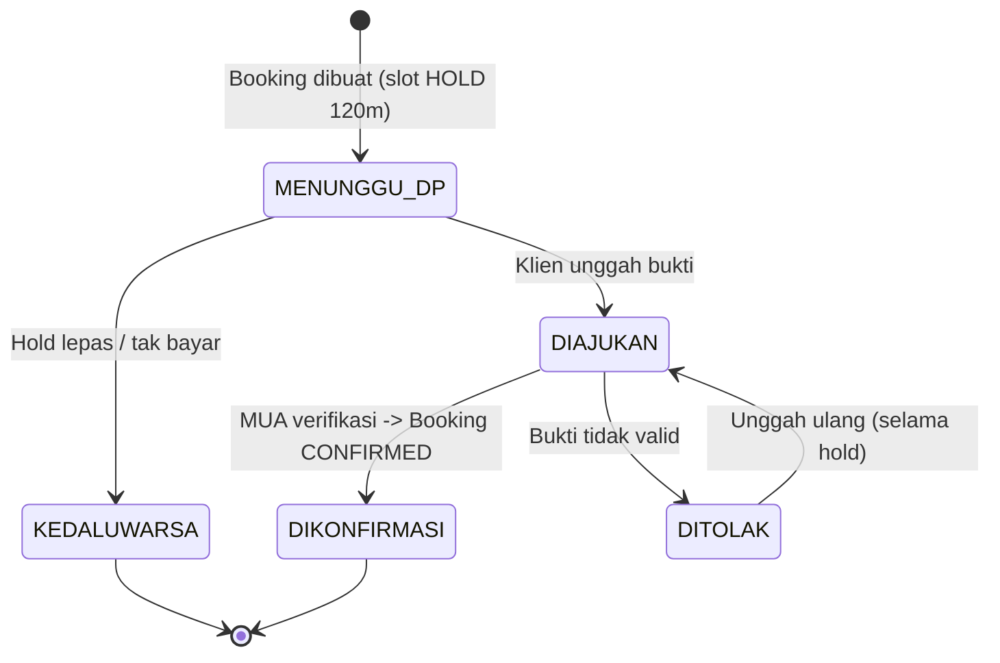

# F06 — Pembayaran Klien → MUA (Manual, Non-Kustodi)

| Atribut | Nilai |
|---------|-------|
| **ID** | F06 |
| **Rilis** | R2 |
| **Modul PRD** | §6.6 / Bab 7 |
| **Kebutuhan Bisnis** | BR-4, RULE-1 |
| **Status** | Draft |
| **Dependensi** | F04 |

## 1. Tujuan
Memfasilitasi DP & pelunasan **langsung dari klien ke MUA** tanpa platform menahan dana. GlowBook hanya **menampilkan instruksi pembayaran**, **menerima bukti**, dan **mencatat status** berdasarkan konfirmasi MUA.

> **RULE-1:** Platform tidak pernah menerima, menahan, atau menyalurkan dana klien.

## 2. User Stories
- **US-F06-1:** Sebagai MUA, saya mengisi instruksi pembayaran (rekening bank/QRIS/e-wallet) di `PaymentProfile`.
- **US-F06-2:** Sebagai klien, saya melihat instruksi DP + nominal lalu transfer langsung ke MUA.
- **US-F06-3:** Sebagai klien, saya mengunggah bukti transfer.
- **US-F06-4:** Sebagai MUA, saya memverifikasi bukti lalu mengonfirmasi → booking terkunci.
- **US-F06-5:** Sebagai klien, saya menerima reminder pelunasan dan mengunggah bukti pelunasan.
- **US-F06-6:** Sebagai MUA, saya bisa menandai "dibayar tunai di lokasi" tanpa bukti.

## 3. Kebutuhan Fungsional (FR)
- **FR-F06-1:** CRUD `PaymentProfile` (bank/QRIS/e-wallet, atas nama, instruksi tambahan, qris_image).
- **FR-F06-2:** Tampilkan instruksi DP pada halaman pasca-submit booking (lihat [F04](F04-booking-mandiri.md)).
- **FR-F06-3:** Unggah bukti → buat `Payment(jenis=dp, status=diajukan, proof_url)`.
- **FR-F06-4:** MUA **konfirmasi** → `Payment.status=dikonfirmasi`, `Booking.status=confirmed`, kunci slot (lihat [F05](F05-kalender-anti-bentrok.md)).
- **FR-F06-5:** MUA **tolak** → `Payment.status=ditolak` + alasan; klien dapat unggah ulang selama hold.
- **FR-F06-6:** Alur **pelunasan**: reminder (H-3/H-1), unggah bukti, konfirmasi → booking `lunas`.
- **FR-F06-7:** Opsi MUA tandai pelunasan **tunai** tanpa bukti.
- **FR-F06-8:** Audit setiap perubahan status pembayaran (siapa, kapan, gambar).
- **FR-F06-9:** Disclaimer non-kustodi tampil di halaman pembayaran klien.

## 4. Alur DP (mengunci slot)

## 5. Aturan & Logika Bisnis
- Slot terkunci **permanen** hanya saat DP `dikonfirmasi`.
- Pembatalan & refund DP diatur **di luar platform** (kebijakan MUA); platform mencatat status `dibatalkan` + catatan refund.
- Reschedule: DP tetap mengikat; cek anti-bentrok pada slot baru.
- Platform **tidak menengahi sengketa dana** — hanya menyediakan jejak bukti & komunikasi.

## 6. Data Terkait
`PaymentProfile`, `Payment`, `Booking` (F04/F05), `AuditLog`.

## 7. API / Endpoint (indikatif)
- `GET/POST/PUT /payment-profiles`
- `GET /bookings/{kode}/payment-instructions` (publik)
- `POST /bookings/{kode}/payments` (unggah bukti)
- `POST /bookings/{id}/payments/{pid}/confirm` · `.../reject`
- `POST /bookings/{id}/mark-cash`

## 8. Status / State Machine
`Payment.status`: `menunggu → diajukan → dikonfirmasi | ditolak`. Pelunasan mengikuti pola sama dengan `jenis=pelunasan`.

## 9. Edge Case
| Kasus | Penanganan |
|------|------------|
| Nominal bukti tidak sesuai | MUA tolak + alasan; klien transfer selisih / unggah ulang. |
| Bukti palsu/duplikat | Verifikasi pada MUA; platform sediakan timestamp + gambar untuk sengketa. |
| Klien tak bayar dalam hold | Hold lepas → booking `expired` (lihat [F05](F05-kalender-anti-bentrok.md)). |
| PaymentProfile belum diisi | Booking tetap bisa dibuat? → blokir publish jika tak ada PaymentProfile aktif (lihat [F01](F01-onboarding-tenant.md)). |
| Refund | Di luar platform; status `dibatalkan` + catatan. |

## 10. Kriteria Penerimaan (AC)
- **AC-F06-1:** Tidak ada saldo dana klien yang tersimpan/diproses platform (audit alur).
- **AC-F06-2:** Slot terkunci permanen hanya setelah MUA mengonfirmasi DP.
- **AC-F06-3:** Setiap perubahan status pembayaran ter-audit dengan bukti & pelaku.
- **AC-F06-4:** Disclaimer non-kustodi tampil pada halaman pembayaran klien.

## 11. Di Luar Lingkup Fitur
- Pembayaran otomatis via gateway untuk klien (Opsi C) — dipertimbangkan saat skala.
- Rekonsiliasi bank otomatis.

## 12. Metrik
Rasio DP diajukan→dikonfirmasi, waktu konfirmasi rata-rata, jumlah bukti ditolak, jumlah booking expired karena DP.
