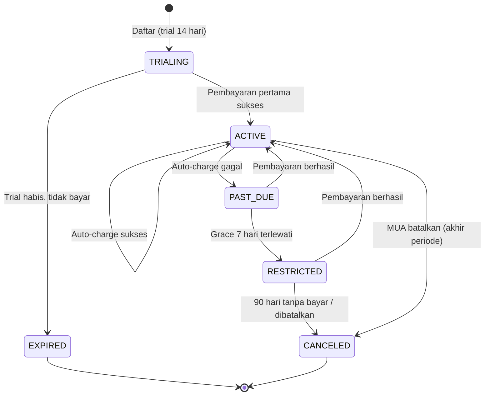
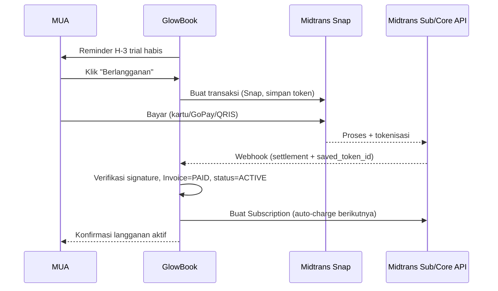

# F07 — Langganan MUA → Platform (Midtrans Otomatis)

| Atribut | Nilai |
|---------|-------|
| **ID** | F07 |
| **Rilis** | R2 |
| **Modul PRD** | §6.7 / Bab 8 |
| **Kebutuhan Bisnis** | BR-7, RULE-2* (revisi), RULE-6 |
| **Status** | Draft |
| **Dependensi** | F01 |

## 1. Tujuan
Memungut **langganan bulanan per tenant secara otomatis** dengan Midtrans (settle ke **rekening Platform**), dengan **tier harga berdasarkan kuota volume order**. Menangani trial, auto-charge, penghitungan kuota & overage, kegagalan bayar (dunning), grace period, dan pembatasan fitur saat past-due. **Billing per tenant** (Paket A: 1 user : 1 tenant — lihat [business-model.md](../business-model.md)).

> Langganan adalah pendapatan platform sendiri → **tidak melanggar RULE-1** (yang melarang menahan dana **klien**). Model tier kuota = **revisi RULE-2** (tetap langganan, bukan komisi per transaksi).

## 1.1 Tier & Kuota *(placeholder — finalkan)*
| Tier | Kuota order/bln | Harga/bln |
|------|-----------------|-----------|
| Trial | penuh (14 hari) | gratis |
| Basic | ≤ 30 | Rp 20.000 |
| Pro | 31 – 100 | Rp 50.000 |
| Bisnis | > 100 / unlimited | Rp 150.000 |

- **Order dihitung = booking `CONFIRMED`** (DP dikonfirmasi, lihat [F06](F06-pembayaran-klien-manual.md)). `EXPIRED`/`CANCELED` tidak dihitung. **1 booking = 1 order** (walau multi-layanan).
- **Overage (default):** soft-block konfirmasi order di atas kuota → minta upgrade. Lihat [business-model.md](../business-model.md) §3.4.

## 2. User Stories
- **US-F07-1:** Sebagai MUA, saya berlangganan di akhir trial dengan kartu/GoPay/QRIS via Midtrans.
- **US-F07-2:** Sebagai MUA, tagihan bulan berikutnya **ditagih otomatis** tanpa saya bayar manual.
- **US-F07-3:** Sebagai MUA, saya menerima notifikasi bila pembayaran gagal dan bisa memperbarui metode.
- **US-F07-4:** Sebagai MUA, saya bisa melihat & mengunduh riwayat invoice.
- **US-F07-5:** Sebagai MUA, saya bisa membatalkan langganan (berlaku akhir periode).
- **US-F07-6:** Sebagai MUA, saya melihat pemakaian kuota order ("18 / 30") dan diberi tahu saat mendekati/melebihi batas.
- **US-F07-7:** Sebagai MUA, saya bisa upgrade tier 1-klik saat kuota habis agar tetap bisa mengonfirmasi order.
- **US-F07-8:** Sebagai MUA, langganan, tagihan, & kuota menempel pada tenant saya (Paket A: 1 user : 1 tenant).

## 3. Kebutuhan Fungsional (FR)
- **FR-F07-1:** **Tier berjenjang** berdasarkan kuota order/bulan (Basic/Pro/Bisnis); `Plan` menyimpan `order_quota` per tier (null = unlimited). Lihat [business-model.md](../business-model.md).
- **FR-F07-2:** Aktivasi via **Snap** (pembayaran pertama + tokenisasi untuk auto-charge).
- **FR-F07-3:** **Dua jalur** penagihan:
  - **Auto-charge** (kartu/GoPay) via **Midtrans Subscription API** + `saved_token_id`.
  - **Invoice + Snap link** (QRIS/VA/e-wallet non-tokenizable) dikirim sebelum jatuh tempo.
- **FR-F07-4:** **Webhook handler** `POST /webhooks/midtrans`: verifikasi signature, idempoten, konfirmasi via Get Status API.
- **FR-F07-5:** Buat `Invoice` per siklus; status `PAID|PENDING|FAILED`; perpanjang periode saat `PAID`.
- **FR-F07-6:** **Dunning**: retry H+0/H+1/H+3/H+7 + notifikasi tiap percobaan (lihat [F08](F08-notifikasi.md)).
- **FR-F07-7:** **Grace 7 hari** di `PAST_DUE` (fitur tetap aktif), lalu `RESTRICTED`.
- **FR-F07-8:** **Mode restricted**: storefront unpublish, notifikasi nonaktif, dashboard read-only; data ditahan 90 hari.
- **FR-F07-9:** Pembatalan berlaku **akhir periode** (`current_period_end`); auto-charge dihentikan.
- **FR-F07-10:** Riwayat invoice + unduh PDF.
- **FR-F07-11:** **Penghitung kuota** per tenant per periode (`orders_used_period`), bertambah saat booking → `CONFIRMED` (lihat [F06](F06-pembayaran-klien-manual.md)), reset tiap awal siklus.
- **FR-F07-12:** **Notifikasi & overage**: 80% kuota → notif "mendekati batas"; 100% → minta upgrade; default **soft-block** konfirmasi order di atas kuota sampai upgrade.
- **FR-F07-13:** **Perubahan tier**: upgrade efektif **segera** (perbarui/ciptakan ulang langganan Midtrans dengan nominal baru); downgrade efektif **akhir periode** (tanpa proration).
- **FR-F07-14:** **Billing per tenant**: setiap tenant punya `Subscription` sendiri (Paket A: 1 tenant/user). Multi-tenant per user = paket masa depan.

## 4. Metode & Strategi Auto-Charge
| Jalur | Metode | Mekanisme | Pengalaman |
|------|--------|-----------|------------|
| **Auto-charge (utama)** | Kartu, **GoPay** (token) | Subscription API + `saved_token_id` | Sepenuhnya otomatis |
| **Invoice + Snap (fallback)** | QRIS, VA, e-wallet | Snap link sebelum jatuh tempo | Semi-otomatis (1 klik) |

## 5. Integrasi Teknis
- **Akun Midtrans milik Platform**; server key di secret manager, **tidak pernah** ke klien.
- **Snap (FE):** pembayaran pertama & fallback; client key publik untuk render.
- **Subscription API:** `name, amount, currency=IDR, payment_type, token, schedule{interval:1, interval_unit:month, start_time}, retry_schedule`.
- **Webhook (HTTP Notification):** terima status transaksi & subscription.

### Verifikasi & Keamanan Webhook
- **Signature wajib:** `signature_key == SHA512(order_id + status_code + gross_amount + ServerKey)`.
- **Idempotensi** berdasarkan `order_id`/`transaction_id`.
- **Sumber kebenaran:** konfirmasi status final via **Get Status API**, bukan hanya payload webhook.
- Hanya HTTPS; tolak payload tanpa signature valid. **Tidak menyimpan PAN** (hanya token Midtrans).

### Pemetaan Status Transaksi → Internal
| `transaction_status` | `fraud_status` | Tindakan |
|---|---|---|
| `capture` | `accept` | Invoice `PAID`, perpanjang periode |
| `settlement` | — | Invoice `PAID`, perpanjang periode |
| `pending` | — | Invoice `PENDING` |
| `deny`/`cancel`/`expire` | — | Invoice `FAILED` → dunning |
| `refund`/`partial_refund` | — | Catat refund |
| `capture` | `challenge` | Tahan, tinjau manual |

## 6. State Machine Langganan

## 7. Alur Aktivasi (akhir trial)

## 8. Data Terkait
`Plan` [global], `Subscription` (+`orders_used_period`), `Invoice`, `Tenant.status`, `Booking` (sumber hitung kuota), `AuditLog`.

## 9. API / Endpoint (indikatif)
- `POST /billing/subscribe` (buat transaksi Snap)
- `POST /webhooks/midtrans` (handler webhook)
- `GET /billing/subscription` · `POST /billing/cancel`
- `GET /billing/invoices` · `GET /billing/invoices/{id}/pdf`
- `POST /billing/update-payment-method`

## 10. Edge Case
- Webhook ganda → idempoten, abaikan duplikat.
- Webhook terlambat/hilang → polling Get Status API terjadwal.
- Token kadaluwarsa/kartu ditolak → dunning; minta perbarui metode.
- Refund manual (admin) → catat di `Invoice`, sesuaikan status.
- Trial habis tanpa bayar → fitur dibatasi, data ditahan 90 hari.

## 11. Kebijakan Refund & Proration
- **MVP: tanpa proration.** Pembatalan berlaku akhir periode; akses sampai `current_period_end`.
- **Tanpa refund** periode berjalan kecuali kasus khusus disetujui admin (refund manual via Midtrans, dicatat di `Invoice`).

## 12. Kriteria Penerimaan (AC)
- **AC-F07-1:** Server key Midtrans tidak pernah terekspos ke klien/browser.
- **AC-F07-2:** Setiap webhook diverifikasi signature & idempoten; status final dikonfirmasi via Get Status API.
- **AC-F07-3:** Auto-charge sukses memperpanjang periode tanpa intervensi manual.
- **AC-F07-4:** Gagal bayar memicu dunning, lalu pembatasan fitur sesuai §3 setelah grace 7 hari.
- **AC-F07-5:** Trial habis tanpa bayar → fitur dibatasi, data ditahan 90 hari.
- **AC-F07-6:** Kuota bertambah hanya untuk booking `CONFIRMED`; saat kuota terlampaui, konfirmasi order baru diblokir sampai upgrade (sesuai kebijakan overage).
- **AC-F07-7:** Langganan, kuota, & status `RESTRICTED` dihitung & ditegakkan **per tenant** (Paket A: 1 tenant/user).

## 13. Metrik
`subscription_activated`, trial→paid conversion (per tenant), `payment_failed`, recovery rate dunning, churn per tenant (<5%, OBJ-2), MRR, **ARPU per tenant**, distribusi tenant per tier, rasio upgrade/downgrade.
