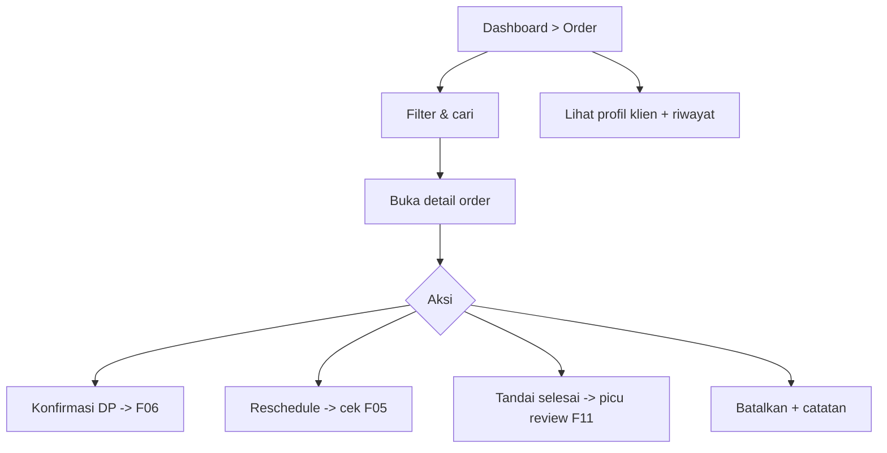

# F09 — Manajemen Order & Data Klien

| Atribut | Nilai |
|---------|-------|
| **ID** | F09 |
| **Rilis** | R1 |
| **Modul PRD** | §6.9 |
| **Kebutuhan Bisnis** | BR-6 |
| **Status** | Draft |
| **Dependensi** | F04 |

## 1. Tujuan
Memberi MUA satu tempat untuk melihat & mengelola semua order (booking) dan riwayat klien — mengubah booking, konfirmasi, reschedule, batal, dan menyimpan catatan klien.

## 2. User Stories
- **US-F09-1:** Sebagai MUA, saya melihat daftar order dengan filter status/tanggal.
- **US-F09-2:** Sebagai MUA, saya membuka detail order (layanan, biaya, pembayaran, custom field).
- **US-F09-3:** Sebagai MUA, saya mengubah status order: konfirmasi, selesai, batal, reschedule.
- **US-F09-4:** Sebagai MUA, saya melihat profil & riwayat klien yang terbentuk otomatis.
- **US-F09-5:** Sebagai MUA, saya menambah catatan pada klien (preferensi, alergi, dll.).

## 3. Kebutuhan Fungsional (FR)
- **FR-F09-1:** Daftar order: filter status (`AWAITING_DP`, `CONFIRMED`, `PAID`, `COMPLETED`, `CANCELED`, `EXPIRED`), rentang tanggal, pencarian nama.
- **FR-F09-2:** Detail order: line item, biaya, status pembayaran (lihat [F06](F06-pembayaran-klien-manual.md)), custom values, lokasi.
- **FR-F09-3:** Aksi status: konfirmasi (via konfirmasi DP), tandai selesai, batalkan, **reschedule** (cek anti-bentrok [F05](F05-kalender-anti-bentrok.md)).
- **FR-F09-4:** Profil `Client` otomatis dari booking; agregasi `total_booking`.
- **FR-F09-5:** Catatan bebas per klien + riwayat order klien.
- **FR-F09-6:** Semua data ter-scope `tenant_id` (isolasi).

## 4. Alur Pengguna (UX Flow)

## 5. Aturan & Logika Bisnis
- Reschedule harus lolos cek anti-bentrok pada slot tujuan; DP tetap mengikat.
- Order `COMPLETED` memicu permintaan ulasan (lihat [F11](F11-ulasan-rating.md)).
- Pembatalan menyimpan alasan + catatan refund (refund di luar platform, lihat [F06](F06-pembayaran-klien-manual.md)).

## 6. Data Terkait
`Booking`, `BookingItem`, `Client`, `Payment` (F06).

## 7. API / Endpoint (indikatif)
- `GET /bookings?status=&from=&to=&q=`
- `GET /bookings/{id}`
- `POST /bookings/{id}/reschedule` · `.../complete` · `.../cancel`
- `GET /clients` · `GET /clients/{id}` · `PUT /clients/{id}/notes`

## 8. Status / State Machine
Mengikuti status booking (lihat [F05](F05-kalender-anti-bentrok.md)) + status pembayaran (lihat [F06](F06-pembayaran-klien-manual.md)).

## 9. Edge Case
- Reschedule ke slot tak tersedia → ditolak.
- Batalkan order yang sudah lunas → konfirmasi + catatan refund manual.
- Klien dengan nomor WA sama pada booking berbeda → digabung ke satu profil.

## 10. Kriteria Penerimaan (AC)
- **AC-F09-1:** Order dapat difilter & dicari; detail menampilkan biaya & status pembayaran akurat.
- **AC-F09-2:** Reschedule selalu melewati cek anti-bentrok.
- **AC-F09-3:** Profil klien terbentuk otomatis dan tidak bocor antar tenant.

## 11. Di Luar Lingkup Fitur
- Segmentasi/marketing klien lanjutan.
- Ekspor massal / CRM eksternal.

## 12. Metrik
Jumlah order per status, rasio reschedule/batal, repeat client rate.
